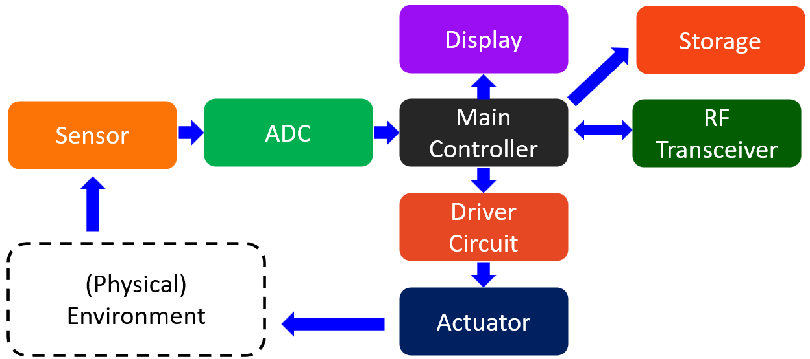
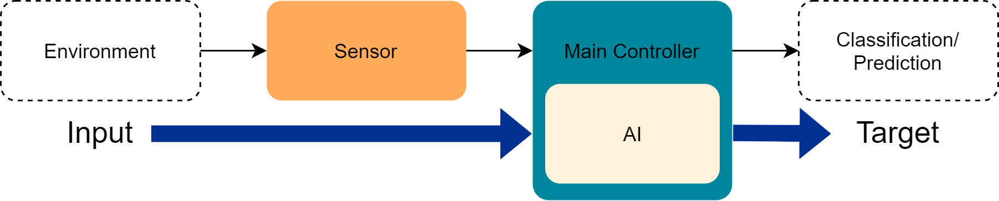
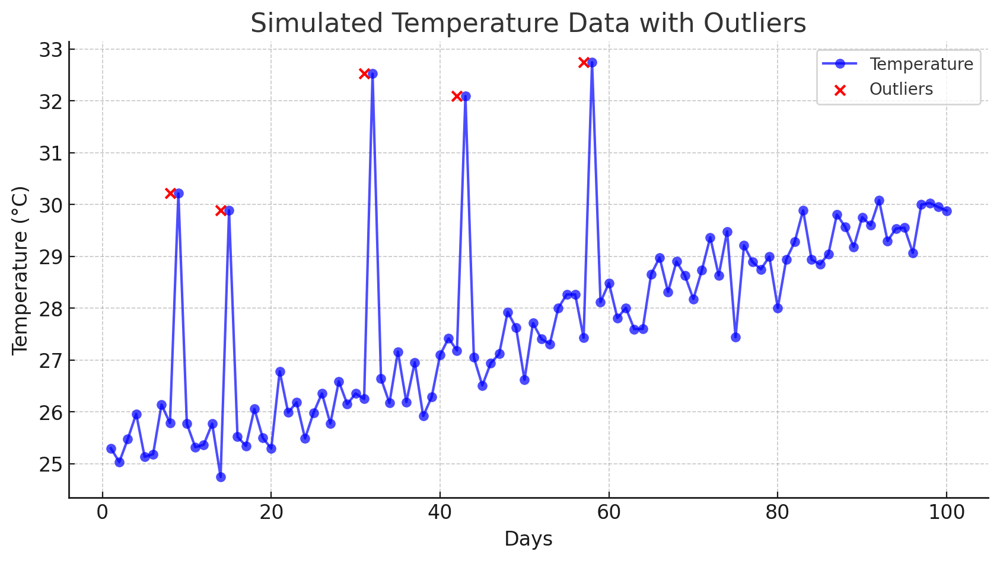
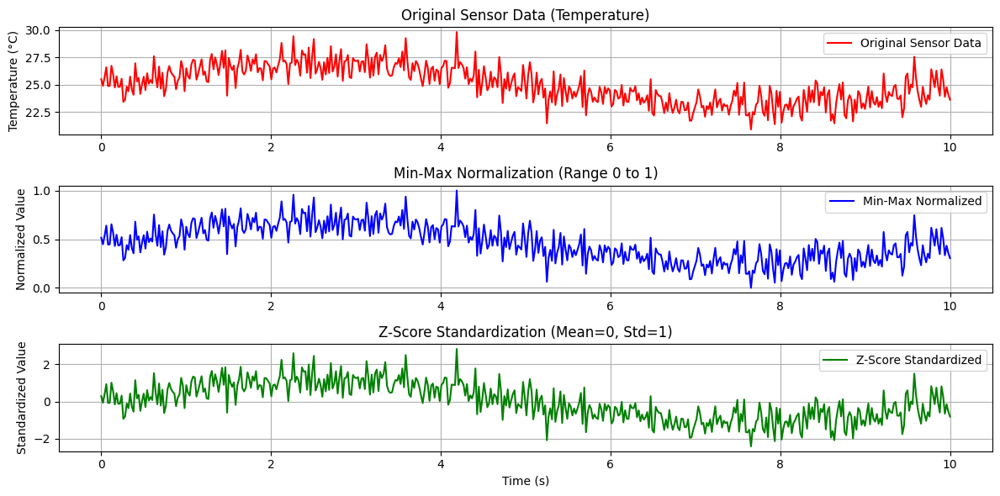
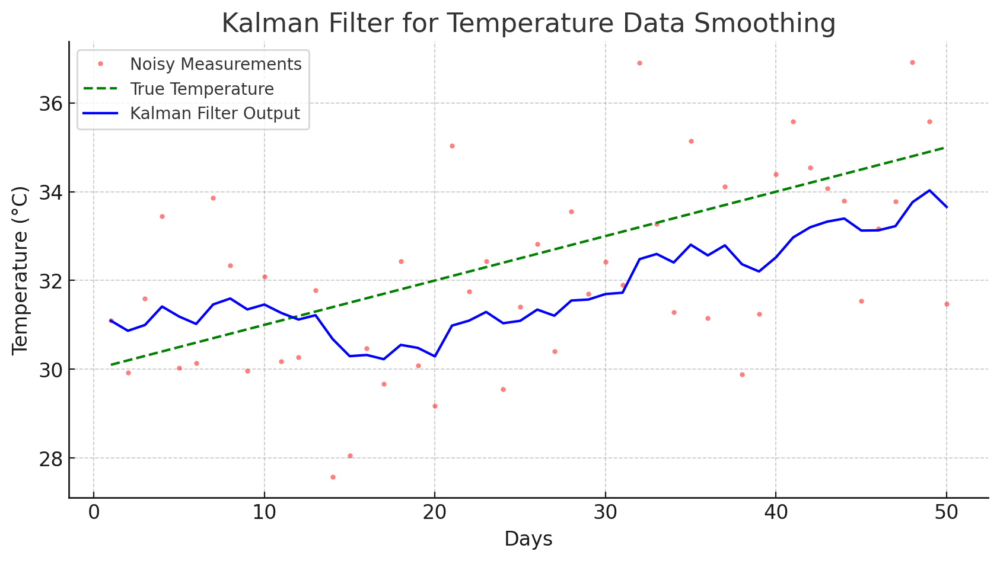
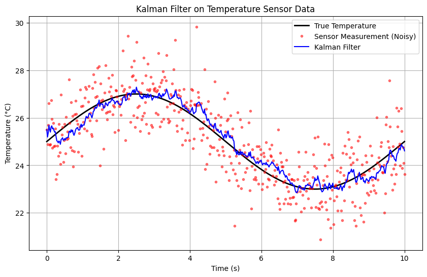
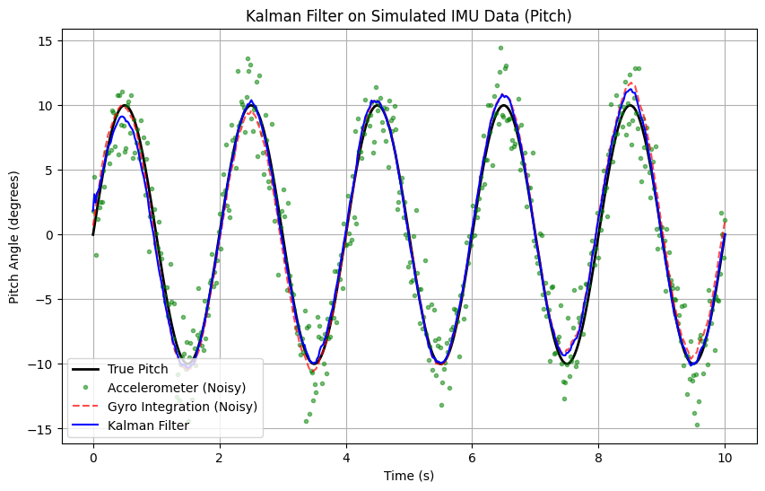
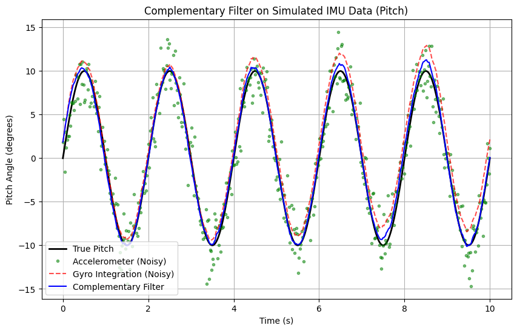
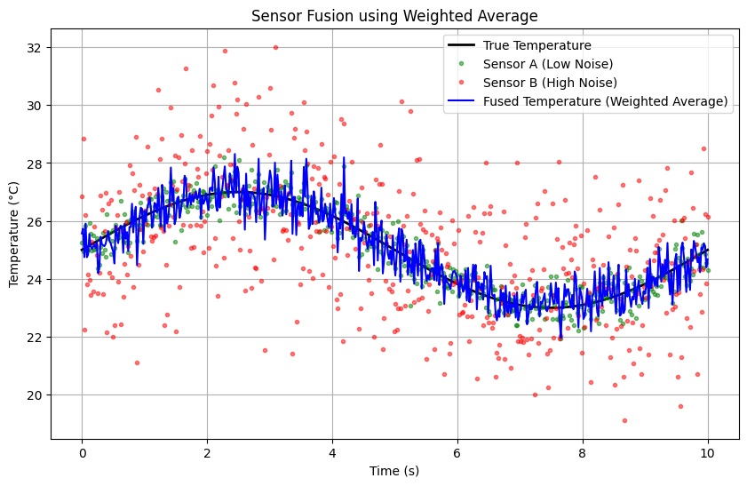

<style>
img[alt~="center"] {
  display: block;
  margin: 0 auto;
}
</style>

### Data Acquisition, Sensor Filtering and Fusion Techniques

---
#### **Embedded System Architecture**



---
#### **Embedded AI Data Flow**

 
- **Sensor** Berfungsi untuk mengumpulkan data dari lingkungan, seperti suhu, kelembaban, akselerasi, atau sinyal biometrik.  
- **Main Controller** bertanggung jawab untuk memproses data dari sensor dan meneruskannya ke modul AI.  
---
- **AI (Artificial Intelligence)** Berada dalam **Main Controller** untuk menganalisis data yang diterima dari sensor menggunakan model Machine Learning atau Deep Learning untuk melakukan klasifikasi, deteksi pola, atau pengambilan keputusan.  
- Setelah diproses oleh AI, data digunakan untuk berbagai keperluan, seperti **kontrol otomatis, prediksi, atau pemantauan kondisi tertentu**.  
- Output dapat dikirim ke **aktor (motor, alarm, tampilan layar), cloud, atau sistem lain** untuk tindakan lebih lanjut.  
---
#### **Contoh Implementasi**  
- **Sistem IoT untuk pemantauan lingkungan**: Sensor suhu mengirim data ke controller, AI memprediksi tren suhu, dan sistem memberikan peringatan jika suhu terlalu tinggi.  
- **Embedde System untuk kesehatan**: Sensor detak jantung mengirim data ke AI dalam microcontroller, lalu AI menganalisis apakah detak jantung normal atau ada indikasi penyakit.  

---
#### **Mengakses Data dari Sensor**  
- Menggunakan protokol komunikasi seperti **I2C, SPI, UART, atau ADC** untuk membaca data dari sensor.  
- Memanfaatkan **microcontroller (Arduino, ESP32, STM32) atau single-board computer (Raspberry Pi)** untuk menangkap data.  
- Menyimpan data ke dalam format CSV, JSON, atau database untuk analisis lebih lanjut.
---  

#### **Membangun Dataset**  
- **Preprocessing**: Membersihkan data dari noise dan outlier.
- **Normalisasi**: Menyesuaikan skala data agar lebih mudah diproses.    
- **Labeling**: Jika diperlukan untuk supervised learning.  

---
#### **Data Cleaning**



---
#### **Normalisasi**

| Temperature (°C) | Humidity (%) | Pressure (hPa) | Acceleration (m/s²) |  
|------------------|-------------|---------------|----------------------|  
| 25              | 60          | 1000          | 0.5                  |  
| 30              | 65          | 1012          | 1.2                  |  
| 35              | 70          | 1025          | 0.8                  |  
| 40              | 75          | 1030          | 2.5                  |  
| 45              | 80          | 1045          | 3.0                  |  

---
##### **Kenapa Perlu Normalisasi?**  
Data ini memiliki rentang nilai yang berbeda-beda (**Temperature** vs. **Pressure** vs. **Acceleration**). Jika langsung digunakan dalam model Machine Learning, fitur dengan skala lebih besar (seperti **Pressure**) bisa mendominasi hasil prediksi.  

---
##### **Metode Normalisasi yang Bisa Digunakan**  
- **Min-Max Scaling** (Skala [0,1]):
- $X_{\text{scaled}} = \frac{X - X_{\text{min}}}{X_{\text{max}} - X_{\text{min}}}$
- **Standardization (Z-Score Normalization)** (Distribusi normal dengan mean = 0, std = 1):  
- $X_{\text{standardized}} = \frac{X - \mu}{\sigma}$
- **Gunakan Min-Max Scaling** jika algoritma yang digunakan sensitif terhadap skala fitur.
- **Gunakan Z-Score Standardization** jika data perlu didistribusikan secara
---
```python
import numpy as np
import matplotlib.pyplot as plt

# 1. Simulasi data suhu (seperti pada contoh sebelumnya)
np.random.seed(42)
time = np.linspace(0, 10, 500)  # 10 detik, 500 sampel
true_temperature = 25 + 2 * np.sin(2 * np.pi * 0.1 * time)  # Suhu sebenarnya
sensor_temperature = true_temperature + np.random.normal(0, 1, size=len(time))  # Noise ±1°C

# 2. Min-Max Scaling
X_min = np.min(sensor_temperature)
X_max = np.max(sensor_temperature)
sensor_temperature_minmax = (sensor_temperature - X_min) / (X_max - X_min)

# 3. Z-Score Standardization
X_mean = np.mean(sensor_temperature)
X_std = np.std(sensor_temperature)
sensor_temperature_zscore = (sensor_temperature - X_mean) / X_std

# 4. Visualisasi hasil normalisasi
plt.figure(figsize=(12, 6))

plt.subplot(3, 1, 1)
plt.plot(time, sensor_temperature, 'r-', label="Original Sensor Data")
plt.title("Original Sensor Data (Temperature)")
plt.ylabel("Temperature (°C)")
plt.legend()
plt.grid(True)

plt.subplot(3, 1, 2)
plt.plot(time, sensor_temperature_minmax, 'b-', label="Min-Max Normalized")
plt.title("Min-Max Normalization (Range 0 to 1)")
plt.ylabel("Normalized Value")
plt.legend()
plt.grid(True)

plt.subplot(3, 1, 3)
plt.plot(time, sensor_temperature_zscore, 'g-', label="Z-Score Standardized")
plt.title("Z-Score Standardization (Mean=0, Std=1)")
plt.ylabel("Standardized Value")
plt.xlabel("Time (s)")
plt.legend()
plt.grid(True)

plt.tight_layout()
plt.show()
```
---


---

#### **Labeling** 

| Temperature (°C) | Humidity (%) | Pressure (hPa) | Acceleration (m/s²) | Label               |  
|------------------|-------------|---------------|----------------------|---------------------|  
| 25              | 60          | 1000          | 0.5                  | Safe               |  
| 30              | 65          | 1012          | 1.2                  | Safe               |  
| 35              | 70          | 1025          | 0.8                  | Safe               |  
| 40              | 75          | 1030          | 2.5                  | High Risk          |  
| 45              | 80          | 1045          | 3.0                  | Extreme Condition  |  


---
#### **Introduction to Sensor Filtering**  
Sensor filtering digunakan untuk mengurangi noise dan memperbaiki keakuratan data sensor sebelum diproses lebih lanjut.  

---
#### **Kalman Filter**  
- Algoritma berbasis **probabilistic estimation** yang digunakan untuk **prediksi** dan **koreksi** nilai sensor berdasarkan model sistem dan pengukuran aktual.    
- **Contoh penggunaan**: Estimasi posisi drone menggunakan data dari IMU (gyroscope & accelerometer).  
---
```python
from pykalman import KalmanFilter
import numpy as np
from matplotlib import pyplot as plt

# Simulasi data noisy suhu (misalnya dari sensor)
np.random.seed(42)
days = np.arange(1, 51)  # 50 hari
true_temperature = 30 + 0.1 * days  # Tren suhu meningkat
noisy_temperature = true_temperature + np.random.normal(0, 2, size=len(days))  # Tambahkan noise

# Inisialisasi Kalman Filter
kf = KalmanFilter(initial_state_mean=noisy_temperature[0],
                  n_dim_obs=1,
                  transition_matrices=[1],
                  observation_matrices=[1],
                  observation_covariance=4,  # Variance of observation noise (sigma^2)
                  transition_covariance=0.1)  # Model system noise

# Melakukan estimasi dengan Kalman Filter
filtered_temperature, _ = kf.filter(noisy_temperature)

# Plot hasil
plt.figure(figsize=(10, 5))
plt.plot(days, noisy_temperature, 'r.', alpha=0.5, label="Noisy Measurements")
plt.plot(days, true_temperature, 'g--', label="True Temperature")
plt.plot(days, filtered_temperature, 'b-', label="Kalman Filter Output")
plt.xlabel("Days")
plt.ylabel("Temperature (°C)")
plt.title("Kalman Filter for Temperature Data Smoothing")
plt.legend()
plt.grid(True)
plt.show()
```
---



---
- **Noisy Measurements (Titik Merah):** Data suhu yang dikumpulkan dari sensor memiliki noise yang cukup besar.
- **True Temperature (Garis Putus-Putus Hijau):** Nilai suhu sebenarnya yang mengikuti tren kenaikan.
- **Kalman Filter Output (Garis Biru):** Estimasi suhu hasil filtering menggunakan Kalman Filter, yang lebih halus dan mendekati suhu sebenarnya.
---

##### 1. **Tahap Prediksi (Prediction Step)**  
Pada tahap ini, Kalman Filter memprediksi keadaan sistem berdasarkan model sebelumnya.

- **Prediksi keadaan (state estimate):**  
 $
  \hat{x}_k^{-} = A \hat{x}_{k-1} + B u_k
 $
  - $\hat{x}_k^{-}$= prediksi keadaan pada waktu $k$ 
  - $A$= matriks transisi keadaan  
  - $\hat{x}_{k-1}$= keadaan sebelumnya  
  - $B$= matriks kontrol (jika ada kontrol input)  
  - $u_k$= kontrol input (jika ada)  
---
- **Prediksi kovarians error:**  
 $
  P_k^{-} = A P_{k-1} A^T + Q
 $
  - $P_k^{-}$= prediksi kovarians error  
  - $P_{k-1}$= kovarians error sebelumnya  
  - $Q$= kovarians noise proses  

---

##### 2. **Tahap Update (Correction Step)**  
Setelah prediksi, Kalman Filter memperbarui estimasi berdasarkan pengukuran baru.

- **Menghitung Kalman Gain:**  
 $
  K_k = P_k^{-} H^T (H P_k^{-} H^T + R)^{-1}
 $
  - $K_k$= Kalman Gain  
  - $H$= matriks observasi  
  - $R$= kovarians noise pengukuran  
---
- **Memperbarui estimasi keadaan:**  
 $
  \hat{x}_k = \hat{x}_k^{-} + K_k (z_k - H \hat{x}_k^{-})
 $
  - $z_k$= pengukuran baru  

- **Memperbarui kovarians error:**  
 $
  P_k = (I - K_k H) P_k^{-}
 $
  - $I$= matriks identitas  

---
```python
import numpy as np
import matplotlib.pyplot as plt

# 1. Simulasi data suhu
np.random.seed(42)
time = np.linspace(0, 10, 500)  # 10 detik, 500 sampel

# Suhu sebenarnya (misalnya suhu ruangan berubah perlahan)
true_temperature = 25 + 2 * np.sin(2 * np.pi * 0.1 * time)  

# Data sensor dengan noise
sensor_temperature = true_temperature + np.random.normal(0, 1, size=len(time))  # noise ±1°C

# 2. Inisialisasi Kalman Filter
x_est = np.zeros_like(time)  # Estimasi suhu
P = np.zeros_like(time)      # Kovarians error

x_est[0] = sensor_temperature[0]  # Inisialisasi dengan nilai sensor pertama
P[0] = 1  # Inisialisasi variansi awal

Q = 0.01  # Variansi noise proses (tuning parameter)
R = 1.0   # Variansi noise pengukuran (tuning parameter)

# 3. Loop Kalman Filter
for k in range(1, len(time)):
    # *** Prediction Step ***
    x_pred = x_est[k-1]  # Asumsi suhu berubah perlahan (tanpa model kecepatan)
    P_pred = P[k-1] + Q  # Prediksi kovarians error

    # *** Update Step ***
    K = P_pred / (P_pred + R)  # Kalman Gain
    x_est[k] = x_pred + K * (sensor_temperature[k] - x_pred)  # Update estimasi suhu
    P[k] = (1 - K) * P_pred  # Update kovarians error

# 4. Visualisasi hasil
plt.figure(figsize=(10, 6))
plt.plot(time, true_temperature, 'k-', label='True Temperature', linewidth=2)
plt.plot(time, sensor_temperature, 'r.', alpha=0.5, label='Sensor Measurement (Noisy)')
plt.plot(time, x_est, 'b-', label='Kalman Filter')

plt.title("Kalman Filter on Temperature Sensor Data")
plt.xlabel("Time (s)")
plt.ylabel("Temperature (°C)")
plt.legend()
plt.grid(True)
plt.show()
```
---


---
```python
import numpy as np
import matplotlib.pyplot as plt

# 1. Inisialisasi data simulasi
np.random.seed(42)
time = np.linspace(0, 10, 500)  # 10 detik, 500 sampel
dt = time[1] - time[0]          # Delta t

# Sudut pitch sebenarnya (sinusoidal)
true_pitch = 10 * np.sin(2 * np.pi * 0.5 * time)

# Gyroscope rate (turunan dari pitch)
true_gyro_rate = np.gradient(true_pitch, dt)

# Tambahkan noise
gyro_rate_noisy = true_gyro_rate + np.random.normal(0, 5, size=len(time))  # noise ±5 deg/s
acc_pitch_noisy = true_pitch + np.random.normal(0, 2, size=len(time))      # noise ±2 deg

# 2. Inisialisasi variabel Kalman Filter
x_est = np.zeros_like(time)  # Estimasi sudut
P = np.zeros_like(time)      # Kovarians error

x_est[0] = acc_pitch_noisy[0]  # Inisialisasi dengan sudut dari accelerometer
P[0] = 1  # Inisialisasi variansi awal

Q = 0.001  # Variansi noise proses (tuning parameter)
R = 2.0    # Variansi noise pengukuran (tuning parameter)

# 3. Loop Kalman Filter
for k in range(1, len(time)):
    # *** Prediction Step ***
    x_pred = x_est[k-1] + gyro_rate_noisy[k] * dt  # Prediksi sudut dengan gyro
    P_pred = P[k-1] + Q  # Prediksi kovarians error

    # *** Update Step ***
    K = P_pred / (P_pred + R)  # Kalman Gain
    x_est[k] = x_pred + K * (acc_pitch_noisy[k] - x_pred)  # Update estimasi sudut
    P[k] = (1 - K) * P_pred  # Update kovarians error

# 4. Visualisasi hasil
plt.figure(figsize=(10, 6))
plt.plot(time, true_pitch, 'k-', label='True Pitch', linewidth=2)
plt.plot(time, acc_pitch_noisy, 'g.', alpha=0.5, label='Accelerometer (Noisy)')
plt.plot(time, gyro_rate_noisy.cumsum() * dt, 'r--', alpha=0.7, label='Gyro Integration (Noisy)')
plt.plot(time, x_est, 'b-', label='Kalman Filter')

plt.title("Kalman Filter on Simulated IMU Data (Pitch)")
plt.xlabel("Time (s)")
plt.ylabel("Pitch Angle (degrees)")
plt.legend()
plt.grid(True)
plt.show()
```
---


---
##### **b. Complementary Filter**  
- Metode filtering sederhana yang menggabungkan **sinyal frekuensi rendah** dari satu sensor dan **sinyal frekuensi tinggi** dari sensor lain.  
- Sering digunakan untuk **sensor IMU** (accelerometer dan gyroscope) dalam pelacakan orientasi.  
- **Keunggulan**: Lebih ringan dibandingkan Kalman Filter dan cocok untuk sistem real-time.  
- **Contoh penggunaan**: Meningkatkan akurasi sensor IMU.  

---
Complementary Filter memanfaatkan karakteristik **gyroscope** (akurat pada frekuensi tinggi, tetapi rentan *drift* jangka panjang) dan **accelerometer** (akurat pada frekuensi rendah, tetapi sangat sensitif terhadap getaran dan noise dinamis).  
- Komponen **gyroscope** di-*integrasi*kan secara terus-menerus untuk mendapatkan perubahan sudut (*angular rate integration*).  
- Komponen **accelerometer** digunakan sebagai *baseline* yang lebih stabil untuk sudut statis.  
---
- Kedua sinyal ini dikombinasikan secara komplementer dengan *weighting* tertentu, misalnya menggunakan konstanta $\alpha$ untuk gyroscope dan $(1 - \alpha)$ untuk accelerometer.
---
###### Formula *complementary filter* untuk sudut $\theta$ adalah:  
$\theta_{\text{combined}}(t) = \alpha \left[\theta_{\text{combined}}(t-1) + \omega_{\text{gyro}}(t) \cdot \Delta t \right] \;+\; (1-\alpha)\,\theta_{\text{acc}}(t)$  


- $\theta_{\text{combined}}(t)$ = sudut hasil filter pada waktu $t$.  
- $\omega_{\text{gyro}}(t)$ = laju rotasi (rate) dari gyroscope pada waktu $t$.  
- $\theta_{\text{acc}}(t)$ = sudut hasil perhitungan dari data akselerometer (misalnya pitch) pada waktu $t$.  
- $\alpha$ = konstanta yang menentukan bobot gyroscope vs. accelerometer.  
- $\Delta t$ = selang waktu pembacaan sensor.  

---
```python
import numpy as np
import matplotlib.pyplot as plt

# 1. Membuat data simulasi
np.random.seed(42)
time = np.linspace(0, 10, 500)  # 10 detik, 500 sampel
dt = time[1] - time[0]         # Delta t

# Asumsikan ada gerakan pitch sinusoidal + noise
true_pitch = 10 * np.sin(2 * np.pi * 0.5 * time)  # amplitudo 10 derajat, freq 0.5 Hz

# Gyroscope rate (derajat/detik) = turunan dari pitch
true_gyro_rate = np.gradient(true_pitch, dt)

# Tambahkan noise
gyro_rate_noisy = true_gyro_rate + np.random.normal(0, 5, size=len(time))  # noise ±5 deg/s
acc_pitch_noisy = true_pitch + np.random.normal(0, 2, size=len(time))      # noise ±2 deg

# 2. Menghitung sudut dari gyroscope dengan integrasi
gyro_angle = np.zeros_like(time)
gyro_angle[0] = acc_pitch_noisy[0]  # inisialisasi sudut awal sama dengan accelerometer

for i in range(1, len(time)):
    gyro_angle[i] = gyro_angle[i-1] + gyro_rate_noisy[i] * dt

# 3. Menggabungkan data menggunakan Complementary Filter
alpha = 0.98  # bobot untuk gyro (umumnya 0.95 - 0.99)
comp_angle = np.zeros_like(time)
comp_angle[0] = acc_pitch_noisy[0]

for i in range(1, len(time)):
    # Integrasi gyro
    gyro_integration = comp_angle[i-1] + gyro_rate_noisy[i] * dt
    # Sudut dari accelerometer
    acc_angle = acc_pitch_noisy[i]
    # Rumus complementary filter
    comp_angle[i] = alpha * gyro_integration + (1 - alpha) * acc_angle

# 4. Visualisasi hasil
plt.figure(figsize=(10, 6))

plt.plot(time, true_pitch, 'k-', label='True Pitch', linewidth=2)
plt.plot(time, acc_pitch_noisy, 'g.', alpha=0.5, label='Accelerometer (Noisy)')
plt.plot(time, gyro_angle, 'r--', alpha=0.7, label='Gyro Integration (Noisy)')
plt.plot(time, comp_angle, 'b-', label='Complementary Filter')

plt.title("Complementary Filter on Simulated IMU Data (Pitch)")
plt.xlabel("Time (s)")
plt.ylabel("Pitch Angle (degrees)")
plt.legend()
plt.grid(True)
plt.show()
```
---


---
#### **Techniques for Sensor Fusion**  
Sensor fusion adalah teknik menggabungkan data dari beberapa sensor untuk mendapatkan informasi yang lebih akurat dan andal.  

1. **Weighted Averaging**:  
   - Kombinasi linear dari beberapa sumber data dengan bobot tertentu.  
   - Contoh: Menggabungkan suhu dari beberapa sensor untuk meningkatkan akurasi.  
---
##### Konsep Sensor Fusion dengan Weighted Average
- Jika kita memiliki dua sensor yang mengukur variabel yang sama (misalnya, suhu atau sudut), kita dapat menggabungkan keduanya menggunakan rata-rata berbobot:

- $x_{\text{fused}} = w_1 x_1 + w_2 x_2$
- $w_1 + w_2 = 1$
- $x_1$ dan $x_2$ adalah nilai dari masing-masing sensor.
- $w_1$ dan $w_2$ adalah bobot berdasarkan tingkat kepercayaan sensor.

---

##### Contoh Kasus Weighted Average: Sensor Fusion untuk Suhu
Misalkan kita memiliki:
- **Sensor A** (akurasi lebih tinggi, noise lebih kecil)
- **Sensor B** (akurasi lebih rendah, lebih banyak noise)
---
```python
import numpy as np
import matplotlib.pyplot as plt

# 1. Simulasi data suhu sebenarnya
np.random.seed(42)
time = np.linspace(0, 10, 500)  # 10 detik, 500 sampel
true_temperature = 25 + 2 * np.sin(2 * np.pi * 0.1 * time)  # Suhu sebenarnya berubah perlahan

# 2. Sensor A (akurasi tinggi, noise rendah)
sensor_A = true_temperature + np.random.normal(0, 0.5, size=len(time))  # noise ±0.5°C

# 3. Sensor B (akurasi rendah, noise tinggi)
sensor_B = true_temperature + np.random.normal(0, 2, size=len(time))  # noise ±2°C

# 4. Bobot berdasarkan akurasi (misal: bobot invers dari variansi noise)
w_A = 0.8  # Sensor A lebih akurat
w_B = 0.2  # Sensor B kurang akurat

# 5. Sensor Fusion menggunakan weighted average
fused_temperature = w_A * sensor_A + w_B * sensor_B

# 6. Visualisasi hasil
plt.figure(figsize=(10, 6))
plt.plot(time, true_temperature, 'k-', label='True Temperature', linewidth=2)
plt.plot(time, sensor_A, 'g.', alpha=0.5, label='Sensor A (Low Noise)')
plt.plot(time, sensor_B, 'r.', alpha=0.5, label='Sensor B (High Noise)')
plt.plot(time, fused_temperature, 'b-', label='Fused Temperature (Weighted Average)')

plt.title("Sensor Fusion using Weighted Average")
plt.xlabel("Time (s)")
plt.ylabel("Temperature (°C)")
plt.legend()
plt.grid(True)
plt.show()
```
---


---
2. **Bayesian Filtering**:  
   - Digunakan untuk estimasi probabilistik, termasuk **Kalman Filter** dan **Particle Filter**.  
   - Cocok untuk **lokalisasi** dan **tracking objek**.  
3. **Deep Learning-Based Fusion**:  
   - CNN atau LSTM dapat digunakan untuk menyatukan data sensor dalam analisis kompleks.  
   - Contoh: **Multi-modal sensor fusion** pada self-driving cars.  

---

#### **Use Cases: Posture Tracking & Wearable Devices**  
##### **a. Posture Tracking**  
- **Sensor yang digunakan**: IMU (accelerometer + gyroscope), kamera depth seperti Kinect atau LiDAR.  
- **Metode**:  
  - Menggunakan complementary filter untuk menyaring data IMU.  
  - Kalman Filter untuk estimasi postur secara real-time.  
  - Deep learning (LSTM) untuk analisis pola gerakan tubuh.  
- **Aplikasi**: Pemantauan postur kerja, fisioterapi, game berbasis gerakan.  
---
##### **b. Wearable Devices**  
- **Sensor yang digunakan**: ECG, PPG, IMU, SpO2, suhu tubuh.  
- **Metode**:  
  - **Sensor fusion** untuk mendapatkan detak jantung yang lebih akurat dari PPG & ECG.  
  - **Noise filtering** pada data biosignal dengan Kalman filter.  
- **Aplikasi**: Smartwatch, pelacakan kebugaran, deteksi dini penyakit.  
