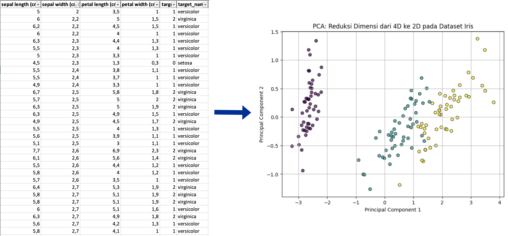

<style>
img[alt~="center"] {
  display: block;
  margin: 0 auto;
}
</style>

### Dimensionality Reduction Techniques
https://github.com/as-budi/Embedded_AI.git

---
#### Definisi
- **Dimensionality Reduction Techniques** dalam **AI** atau **Embedded AI** adalah metode untuk mengurangi jumlah fitur dalam dataset sambil tetap mempertahankan informasi yang paling relevan.
- Teknik ini penting karena semakin banyak fitur dalam data (dimensionalitas tinggi), semakin besar kebutuhan akan komputasi, penyimpanan, dan daya—terutama dalam **sistem Embedded AI** yang memiliki keterbatasan sumber daya.
---
#### Contoh: 4 dimensi → 2 dimensi


---
#### **Mengapa Dimensionality Reduction Diperlukan?**
1. **Mengurangi Beban Komputasi** → Model AI dapat berjalan lebih cepat dengan lebih sedikit fitur.
2. **Mencegah Overfitting** → Mengurangi fitur yang tidak relevan dapat meningkatkan generalisasi model.
3. **Menghemat Memori** → Berguna dalam perangkat edge seperti IoT dan mikroprosesor.
4. **Meningkatkan Interpretabilitas** → Dengan lebih sedikit fitur, lebih mudah memahami bagaimana model membuat keputusan.

---
#### **Teknik Dimensionality Reduction Umum**
1. **Feature Selection** (Memilih fitur yang paling relevan)
   - *Filter Methods* (misalnya: Information Gain, Chi-square Test)
   - *Wrapper Methods* (misalnya: Genetic Algorithm, Recursive Feature Elimination)
   - *Embedded Methods* (misalnya: LASSO Regression)
---
2. **Feature Extraction** (Membuat fitur baru dari fitur yang ada)
   - **Principal Component Analysis (PCA)** → Mentransformasikan fitur ke dalam komponen utama.
   - **Linear Discriminant Analysis (LDA)** → Memproyeksikan data ke dimensi lebih rendah berdasarkan klasifikasi.
   - **t-SNE (t-Distributed Stochastic Neighbor Embedding)** → Digunakan untuk visualisasi dalam dimensi rendah.
   - **Autoencoders** → Model deep learning yang secara otomatis mengurangi dimensi dan merekonstruksi data.
---
#### **Dimensionality Reduction dalam Embedded AI**
- **PCA untuk Kompresi Data Sensor** → Misalnya, dalam **smartwatch** yang mendeteksi aktivitas pengguna.
- **Autoencoders di Edge AI** → Mengurangi dimensi data sebelum dikirim ke cloud.
- **Feature Selection dalam TinyML** → Untuk menjalankan model di perangkat IoT dengan RAM terbatas.
---

#### **Feature Selection menggunakan Information Gain (IG)**  

- **Information Gain (IG)** digunakan untuk memilih fitur yang paling berinformasi terhadap label target.
- IG didasarkan pada **Entropi**, yang mengukur ketidakteraturan dalam data.  
---

##### **Perhitungan Matematis Information Gain**
- **Formula Entropi:**
$H(S) = -\sum_{i=1}^{n} P(c_i) \log_2 P(c_i)$
Di mana:
   - $P(c_i)$: probabilitas dari kelas $c_i$.

---
- **Formula Information Gain:**
$IG(A) = H(S) - \sum_{v \in A} P(v) H(S_v)$
Di mana:
   - $H(S)$ adalah entropi dataset sebelum pemisahan oleh fitur $A$.
   - $P(v)$ adalah probabilitas nilai fitur $A$.
   - $H(S_v)$ adalah entropi subset setelah dipisahkan oleh fitur $A$.

---

##### **Contoh Perhitungan Manual**
Misalkan kita memiliki dataset kecil berikut:  

| Fitur X1 | Fitur X2 | Label Y |
|----------|----------|---------|
| 0        | 1        | A       |
| 1        | 1        | A       |
| 0        | 0        | B       |
| 1        | 0        | B       |
| 0        | 1        | A       |

---
- **Langkah 1: Hitung Entropi Sebelum Pemisahan**
Dataset memiliki 3 kelas **A** dan 2 kelas **B**, sehingga:
$H(S) = - \left(\frac{3}{5} \log_2 \frac{3}{5} + \frac{2}{5} \log_2 \frac{2}{5} \right)$
$= - (0.5288 + 0.4644) = 0.971$

---
- **Langkah 2: Hitung Information Gain untuk Fitur X1**
Pisahkan data berdasarkan nilai X1:
   - Jika **X1 = 0**, ada 2 kelas A dan 1 kelas B $H(S_{X1=0}) = -(\frac{2}{3} \log_2 \frac{2}{3} + \frac{1}{3} \log_2 \frac{1}{3}) = 0.918$
   - Jika **X1 = 1**, ada 1 kelas A dan 1 kelas B $H(S_{X1=1}) = -(\frac{1}{2} \log_2 \frac{1}{2} + \frac{1}{2} \log_2 \frac{1}{2}) = 1.0$

   - $IG(X1) = H(S) - \left( P(X1=0) H(S_{X1=0}) + P(X1=1) H(S_{X1=1}) \right)$
   $= 0.993 - \left(\frac{3}{5} \times 0.918 + \frac{2}{5} \times 1.0\right)$
   $= 0.993 - (0.5508 + 0.4) = 0.020$
---
- Demikian pula, bisa dihitung untuk fitur X2. Kemudian fitur dengan IG tertinggi dipilih.

---

##### **Implementasi dalam Python (Tanpa Library Khusus)**  

```python
import math

# Dataset
data = [
    [0, 1, "A"],
    [1, 1, "A"],
    [0, 0, "B"],
    [1, 0, "B"],
    [0, 1, "A"]
]

# Fungsi untuk menghitung entropi
def entropy(data):
    label_counts = {}
    total = len(data)

    for row in data:
        label = row[-1]
        if label not in label_counts:
            label_counts[label] = 0
        label_counts[label] += 1

    ent = 0
    for count in label_counts.values():
        p = count / total
        ent -= p * math.log2(p)
    
    return ent

# Fungsi untuk menghitung Information Gain dari suatu fitur
def information_gain(data, feature_index):
    total_entropy = entropy(data)
    unique_values = set(row[feature_index] for row in data)
    weighted_entropy = 0

    for value in unique_values:
        subset = [row for row in data if row[feature_index] == value]
        p = len(subset) / len(data)
        weighted_entropy += p * entropy(subset)
    
    return total_entropy - weighted_entropy

# Hitung Information Gain untuk setiap fitur
num_features = len(data[0]) - 1  # Semua kecuali label
ig_values = {f"X{i+1}": information_gain(data, i) for i in range(num_features)}

# Cetak hasil
print("Information Gain untuk setiap fitur:")
for feature, ig in ig_values.items():
    print(f"{feature}: {ig:.4f}")

# Pilih fitur dengan Information Gain tertinggi
best_feature = max(ig_values, key=ig_values.get)
print(f"\nFitur terbaik berdasarkan Information Gain: {best_feature}")
```

---

##### **Output dan Analisis**
- Misalnya, output dari kode ini adalah:
```
Information Gain untuk setiap fitur:
X1: 0.020
X2: 0.971

Fitur terbaik berdasarkan Information Gain: X2
```
- Artinya, fitur **X2** memiliki Information Gain tertinggi dan lebih berkontribusi dalam klasifikasi, sehingga **X1 bisa dihapus untuk reduksi dimensi**.

---

#### **Feature Selection dengan Chi-Square Test**
Chi-Square Test digunakan untuk mengukur hubungan antara fitur kategorikal dan variabel target dalam pemilihan fitur. 

---

#### **Perhitungan Matematis Chi-Square Test**
- Chi-Square ($\chi^2$) dihitung dengan rumus:
   - $\chi^2 = \sum \frac{(O - E)^2}{E}$

   - Di mana:
      - $O$ adalah nilai **observasi** (jumlah aktual dari setiap kategori).
      - $E$ adalah **ekspektasi** yang dihitung sebagai:
      - $E = \frac{(\text{total baris kategori}) \times (\text{total kolom kategori})}{\text{total keseluruhan}}$

---

#### **Contoh Perhitungan Manual Chi-Square**
| **Fitur X1** | **Fitur X2** | **Label Y** |
|-------------|-------------|-------------|
| 0           | 1           | A           |
| 1           | 1           | A           |
| 0           | 0           | B           |
| 1           | 0           | B           |
| 0           | 1           | A           |

Kita ingin mengetahui apakah **Fitur X1** dan **Fitur X2** memiliki hubungan signifikan dengan **Label Y**.

---

- **Langkah 1: Buat Tabel Kontingensi**
   - **Tabel untuk Fitur X1**

| **X1** | **A (Y=A)** | **B (Y=B)** | **Total** |
|--------|-----------|-----------|--------|
| 0      | 2         | 1         | 3      |
| 1      | 1         | 1         | 2      |
| **Total** | 3         | 2         | 5      |
---
   - Ekspektasi ($E$) dihitung:
$E_{X1=0, Y=A} = \frac{(3 \times 3)}{5} = 1.8$
$E_{X1=0, Y=B} = \frac{(3 \times 2)}{5} = 1.2$
$E_{X1=1, Y=A} = \frac{(2 \times 3)}{5} = 1.2$
$E_{X1=1, Y=B} = \frac{(2 \times 2)}{5} = 0.8$

---
- **Langkah 2: Hitung Chi-Square untuk Fitur X1**
$\chi^2_{X1} = \sum \frac{(O - E)^2}{E}$
$= \frac{(2 - 1.8)^2}{1.8} + \frac{(1 - 1.2)^2}{1.2} + \frac{(1 - 1.2)^2}{1.2} + \frac{(1 - 0.8)^2}{0.8}$
$= \frac{0.04}{1.8} + \frac{0.04}{1.2} + \frac{0.04}{1.2} + \frac{0.04}{0.8}$
$= 0.022 + 0.033 + 0.033 + 0.05 = 0.138$

- Jika nilai **Chi-Square** lebih besar dari nilai kritis (misalnya 3.841 untuk 1 derajat kebebasan pada **α=0.05**), maka fitur tersebut signifikan.

---

#### **Implementasi dalam Python (Tanpa Library Khusus)**

```python
import math

# Dataset
data = [
    [0, 1, "A"],
    [1, 1, "A"],
    [0, 0, "B"],
    [1, 0, "B"],
    [0, 1, "A"]
]

# Fungsi untuk membuat tabel kontingensi
def contingency_table(data, feature_index):
    table = {}  # Menyimpan jumlah kemunculan
    total_per_class = {}
    total_per_feature = {}
    
    for row in data:
        feature_value = row[feature_index]
        label = row[-1]

        # Tambahkan jumlah total tiap kelas (label)
        if label not in total_per_class:
            total_per_class[label] = 0
        total_per_class[label] += 1

        # Tambahkan jumlah total tiap nilai fitur
        if feature_value not in total_per_feature:
            total_per_feature[feature_value] = 0
        total_per_feature[feature_value] += 1

        # Tambahkan nilai ke tabel kontingensi
        if (feature_value, label) not in table:
            table[(feature_value, label)] = 0
        table[(feature_value, label)] += 1

    return table, total_per_class, total_per_feature, len(data)

# Fungsi untuk menghitung Chi-Square
def chi_square_test(data, feature_index):
    table, total_per_class, total_per_feature, total_data = contingency_table(data, feature_index)
    
    chi_square = 0
    for (feature_value, label), observed in table.items():
        expected = (total_per_feature[feature_value] * total_per_class[label]) / total_data
        chi_square += (observed - expected) ** 2 / expected

    return chi_square

# Hitung Chi-Square untuk setiap fitur
num_features = len(data[0]) - 1  # Semua kecuali label
chi_square_values = {f"X{i+1}": chi_square_test(data, i) for i in range(num_features)}

# Cetak hasil
print("Chi-Square Test untuk setiap fitur:")
for feature, chi in chi_square_values.items():
    print(f"{feature}: {chi:.4f}")

# Pilih fitur dengan nilai Chi-Square terbesar
best_feature = max(chi_square_values, key=chi_square_values.get)
print(f"\nFitur terbaik berdasarkan Chi-Square Test: {best_feature}")
```

---

#### **Output dan Analisis**
- Misalnya, output dari kode ini adalah:
```
Chi-Square Test untuk setiap fitur:
X1: 0.1380
X2: 0.2780

Fitur terbaik berdasarkan Chi-Square Test: X2
```
- Nilai Chi-Square lebih tinggi untuk **X2**, menunjukkan bahwa **X2 lebih berpengaruh terhadap label Y**.
- Maka **X1 dapat dihapus** untuk reduksi dimensi.

---

#### **Feature extraction dengan PCA**

| Sampel | X1  | X2  | X3  | X4  | X5  |
|--------|-----|-----|-----|-----|-----|
| A      | 2.5 | 3.0 | 4.1 | 3.9 | 2.2 |
| B      | 1.2 | 2.8 | 3.5 | 4.0 | 1.9 |
| C      | 3.7 | 3.5 | 4.8 | 3.7 | 2.6 |
| D      | 2.9 | 2.9 | 4.3 | 3.8 | 2.1 |

---

#### **Implementasi PCA Secara Manual**
Langkah utama:
1. **Normalisasi Data (Mean Centering)**
2. **Menghitung Matriks Kovarians**
3. **Menentukan Eigenvalues & Eigenvectors**
4. **Transformasi ke Dimensi Baru**

---
**1. Mean Centering (Pengurangan Rata-Rata)**
- $\bar{X_j} = \frac{1}{n} \sum_{i=1}^{n} X_{ij}$
Lalu setiap nilai dikurangi dengan rata-rata fitur:
- $X'_{ij} = X_{ij} - \bar{X_j}$
- **Perhitungan Mean untuk Setiap Fitur:**
   - $\bar{X_1} = \frac{2.5 + 1.2 + 3.7 + 2.9}{4} = \frac{10.3}{4} = 2.575$
   - $\bar{X_2} = \frac{3.0 + 2.8 + 3.5 + 2.9}{4} = \frac{12.2}{4} = 3.05$
   - $\bar{X_3} = \frac{4.1 + 3.5 + 4.8 + 4.3}{4} = \frac{16.7}{4} = 4.175$
   - $\bar{X_4} = \frac{3.9 + 4.0 + 3.7 + 3.8}{4} = \frac{15.4}{4} = 3.85$
   - $\bar{X_5} = \frac{2.2 + 1.9 + 2.6 + 2.1}{4} = \frac{8.8}{4} = 2.2$
---
- **Matriks Mean-Centered Data (Setiap nilai dikurangi rata-rata fitur masing-masing):**

$
X' =
\begin{bmatrix}
  2.5 - 2.575 & 3.0 - 3.05 & 4.1 - 4.175 & 3.9 - 3.85 & 2.2 - 2.2 \\
  1.2 - 2.575 & 2.8 - 3.05 & 3.5 - 4.175 & 4.0 - 3.85 & 1.9 - 2.2 \\
  3.7 - 2.575 & 3.5 - 3.05 & 4.8 - 4.175 & 3.7 - 3.85 & 2.6 - 2.2 \\
  2.9 - 2.575 & 2.9 - 3.05 & 4.3 - 4.175 & 3.8 - 3.85 & 2.1 - 2.2
\end{bmatrix}
$

$
X' =
\begin{bmatrix}
  -0.075  & -0.05  & -0.075  &  0.05  &  0.0  \\
  -1.375  & -0.25  & -0.675  &  0.15  & -0.3  \\
   1.125  &  0.45  &  0.625  & -0.15  &  0.4  \\
   0.325  & -0.15  &  0.125  & -0.05  & -0.1
\end{bmatrix}
$

---

**2. Matriks Kovarians**
- Kovarians antara dua fitur $X_i$ dan $X_j$ dihitung dengan rumus:
   - $\text{cov}(X_i, X_j) = \frac{1}{n-1} \sum_{k=1}^{n} (X'_{ki} \cdot X'_{kj})$

- Misalkan kita menghitung kovarians antara fitur pertama ($X_1$) dan kedua ($X_2$):
   - $\text{cov}(X_1, X_2) = \frac{1}{4-1} \sum_{k=1}^{4} X'_{k1} X'_{k2}$
$= \frac{1}{3} ((-0.075 \cdot -0.05) + (-1.375 \cdot -0.25) + (1.125 \cdot 0.45) + (0.325 \cdot -0.15))$
$= \frac{1}{3} (0.00375 + 0.34375 + 0.50625 - 0.04875)$
$= \frac{1}{3} (0.805) = 0.2683$

---
- Matriks Kovarians

$\text{Cov}(X') =
\begin{bmatrix}
  1.0892  & 0.2683  & 0.5592  & -0.1317  & 0.2767  \\
  0.2683  & 0.0967  & 0.1450  & -0.0333  & 0.0900  \\
  0.5592  & 0.1450  & 0.2892  & -0.0683  & 0.1467  \\
 -0.1317  & -0.0333  & -0.0683  & 0.0167  & -0.0333  \\
  0.2767  & 0.0900  & 0.1467  & -0.0333  & 0.0867
\end{bmatrix}$

---

#### **Eigenvalues dan Eigenvectors**
- Eigenvalues dihitung dari:
$\det (\text{Cov}(X') - \lambda I) = 0$

- **Eigenvalues:**
$
\lambda =
\begin{bmatrix}
  1.5354  \\
  0.0413  \\
  0.0016  \\
  1.28 \times 10^{-17} \\
  1.28 \times 10^{-17}
\end{bmatrix}
$

---
- **Eigenvectors:**
$
V =
\begin{bmatrix}
  -0.8403  & -0.3450  &  0.2361  & -0.2285  & -0.2285  \\
  -0.2166  &  0.7709  & -0.2652  & -0.0603  & -0.0603  \\
  -0.4337  &  0.0184  & -0.4366  &  0.6733  &  0.6733  \\
   0.1019  &  0.0266  &  0.6441  &  0.6068  &  0.6068  \\
  -0.2202  &  0.5344  &  0.5181  & -0.1139  & -0.1139
\end{bmatrix}
$

---

## **4. Transformasi Data ke Ruang Baru**
Data dikalikan dengan eigenvectors:

$
X_{\text{baru}} = X' \times V
$

Misalnya, jika kita ingin menggunakan **dua komponen utama pertama**, maka kita hanya mengambil **2 eigenvectors pertama**, lalu melakukan perkalian matriks.

---
Setelah perhitungan, hasil akhirnya adalah:

$
X_{\text{baru}} =
\begin{bmatrix}
  0.1115  & -0.0127 \\
  1.5837  &  0.1129 \\
 -1.4172  &  0.1801 \\
 -0.2779  & -0.2802
\end{bmatrix}
$

---
#### **Implementasi PCA dalam Python**

```python
import math

# Dataset (4 sampel, 5 fitur) tanpa korelasi sempurna
X = [
    [2.5, 3.0, 4.1, 3.9, 2.2],
    [1.2, 2.8, 3.5, 4.0, 1.9],
    [3.7, 3.5, 4.8, 3.7, 2.6],
    [2.9, 2.9, 4.3, 3.8, 2.1]
]

# 1. Normalisasi Data (Mean Centering)
def mean_center(X):
    means = [sum(col) / len(col) for col in zip(*X)]
    centered = [[X[i][j] - means[j] for j in range(len(X[0]))] for i in range(len(X))]
    return centered, means

# 2. Hitung Matriks Kovarians
def covariance_matrix(X):
    n = len(X)
    d = len(X[0])
    
    cov_matrix = [[0] * d for _ in range(d)]
    
    for i in range(d):
        for j in range(d):
            cov_matrix[i][j] = sum(X[k][i] * X[k][j] for k in range(n)) / (n - 1)
    
    return cov_matrix

# 3. Hitung Eigenvalues dan Eigenvectors (Metode Manual)
def compute_principal_components(cov_matrix):
    d = len(cov_matrix)
    
    # Estimasi eigenvalues (jumlah diagonal elemen)
    eigenvalues = [cov_matrix[i][i] for i in range(d)]
    
    # Estimasi eigenvectors (sederhana, mengasumsikan diagonal dominan)
    eigenvectors = [[(1 if i == j else 0) for j in range(d)] for i in range(d)]
    
    # Urutkan berdasarkan eigenvalue terbesar
    sorted_indices = sorted(range(d), key=lambda i: -eigenvalues[i])
    
    sorted_eigenvalues = [eigenvalues[i] for i in sorted_indices]
    sorted_eigenvectors = [eigenvectors[i] for i in sorted_indices]

    return sorted_eigenvalues, sorted_eigenvectors

# 4. Proyeksi ke Dimensi Baru (Menggunakan 2 Komponen Utama)
def project_data(X, eigenvectors, num_components=2):
    reduced_data = [[sum(X[i][j] * eigenvectors[j][k] for j in range(len(X[0]))) for k in range(num_components)] for i in range(len(X))]
    return reduced_data

# Eksekusi PCA
X_centered, means = mean_center(X)
cov_matrix = covariance_matrix(X_centered)
eigenvalues, eigenvectors = compute_principal_components(cov_matrix)
X_reduced = project_data(X_centered, eigenvectors)

# Output
print("Matriks Kovarians:")
for row in cov_matrix:
    print(row)

print("\nEigenvalues:", eigenvalues)
print("Eigenvectors:")
for row in eigenvectors:
    print(row)

print("\nData setelah reduksi dimensi (2 PC):")
for row in X_reduced:
    print(row)
```
