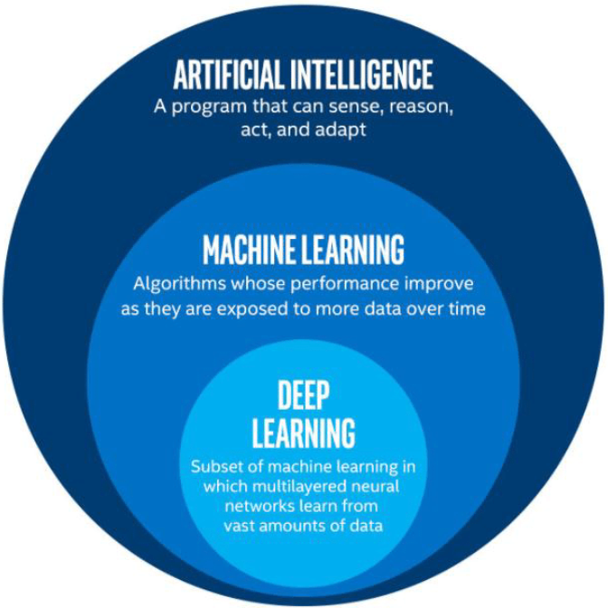
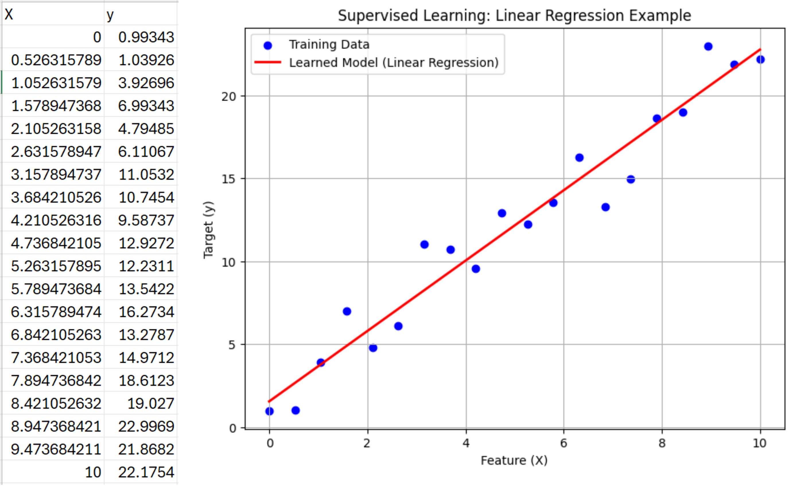
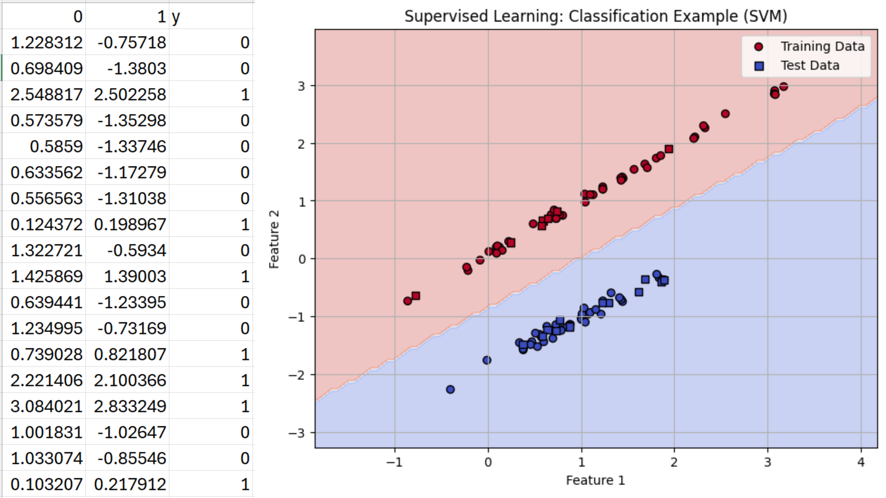
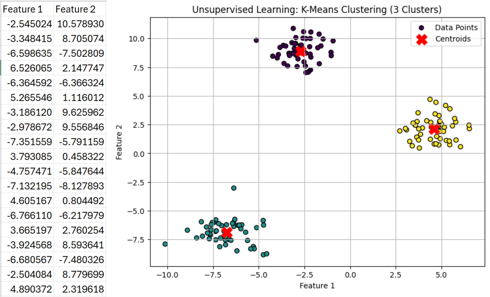
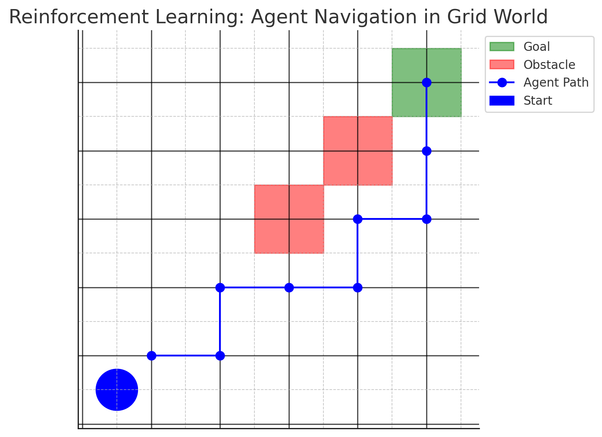

### Machine learning Overview
https://github.com/as-budi/Embedded_AI.git

---
### AI

---
1. **Artificial Intelligence (AI)**
    - Bidang ilmu komputer yang berfokus pada pengembangan sistem yang mampu meniru kecerdasan manusia untuk melakukan tugas-tugas seperti pemecahan masalah, pengenalan pola, pengambilan keputusan, dan pemrosesan bahasa alami.

2. **Machine Learning (ML)**  
   - AI yang belajar dari data dan memperbaiki performanya berdasarkan pengalaman tanpa diprogram secara eksplisit.  
   - Contoh: Algoritma klasifikasi, regresi, clustering.
---
3. **Deep Learning (DL)**  
   - Subset dari ML yang menggunakan jaringan saraf tiruan (Artificial Neural Networks) dengan banyak lapisan (deep networks).  
   - Contoh: CNN untuk pengenalan gambar, RNN/LSTM untuk pemrosesan bahasa alami.  

---

#### **Tipe Pembelajaran dalam Machine Learning**  
1. **Supervised Learning (Pembelajaran Terawasi)**  
   - Model dilatih menggunakan data berlabel.  
   - Contoh: Klasifikasi objek dalam gambar (contoh: mengidentifikasi apakah gambar mengandung mobil atau tidak).  
   - Algoritma: Decision Tree, Support Vector Machine (SVM), Neural Network.  
---
#### **Contoh supervised learning (Linear regression)**

---
#### **Contoh supervised learning (classification)**

---
2. **Unsupervised Learning (Pembelajaran Tak Terawasi)**  
   - Model mencari pola dalam data tanpa label.  
   - Contoh: Clustering data sensor untuk mendeteksi pola anomali dalam perangkat IoT.  
   - Algoritma: K-Means, DBSCAN, Autoencoder.  
---
#### **Contoh unsupervised learning (clustering)**

---
3. **Reinforcement Learning (Pembelajaran Penguatan)**  
   - Model belajar melalui trial and error untuk memaksimalkan reward.  
   - Contoh: Pickup and carrying robot  
   - Algoritma: Q-Learning, Deep Q-Network (DQN).  
---
#### **Contoh reinforcement learning**

---

#### **Use Cases dalam Embedded AI**   
- **Classification (Klasifikasi)**  
  - Contoh: Identifikasi suara manusia dalam perangkat smart home.  
  - Model yang digunakan: CNN (Convolutional Neural Network) untuk pengenalan pola dalam gambar atau suara.  

- **Clustering (Pengelompokan)**  
  - Contoh: Deteksi anomali pada sistem pemantauan kondisi mesin menggunakan data sensor.  
  - Model yang digunakan: K-Means atau DBSCAN untuk mendeteksi pola yang tidak biasa.  
---
- **Prediction (Prediksi)**  
  - Contoh: Perkiraan waktu kedatangan kendaraan berdasarkan data GPS dan sensor lingkungan.  
  - Model yang digunakan: LSTM (Long Short-Term Memory) atau XGBoost untuk analisis data deret waktu.  

---

#### **Tantangan Machine Learning pada Perangkat Embedded**
1. **Keterbatasan Daya Komputasi**  
   - Perangkat embedded memiliki CPU/GPU yang jauh lebih lemah dibandingkan server atau cloud.  
   - Solusi: Gunakan model lightweight seperti TinyML atau quantized neural networks.  

2. **Kapasitas Penyimpanan Terbatas**  
   - Model ML seringkali berukuran besar dan tidak dapat disimpan sepenuhnya dalam memori perangkat.  
   - Solusi: Gunakan model kompresi seperti TensorFlow Lite, pruning, dan quantization.  
---
3. **Efisiensi Energi**  
   - Perangkat embedded sering berjalan dengan baterai, sehingga konsumsi daya harus dioptimalkan.  
   - Solusi: Optimasi inferensi dengan edge computing dan pemrosesan berbasis event-driven.  

4. **Kecepatan dan Latensi**  
   - Model ML harus mampu memberikan hasil cepat dengan latensi minimal.  
   - Solusi: Gunakan algoritma yang efisien secara komputasi, seperti decision tree atau model shallow neural network.  