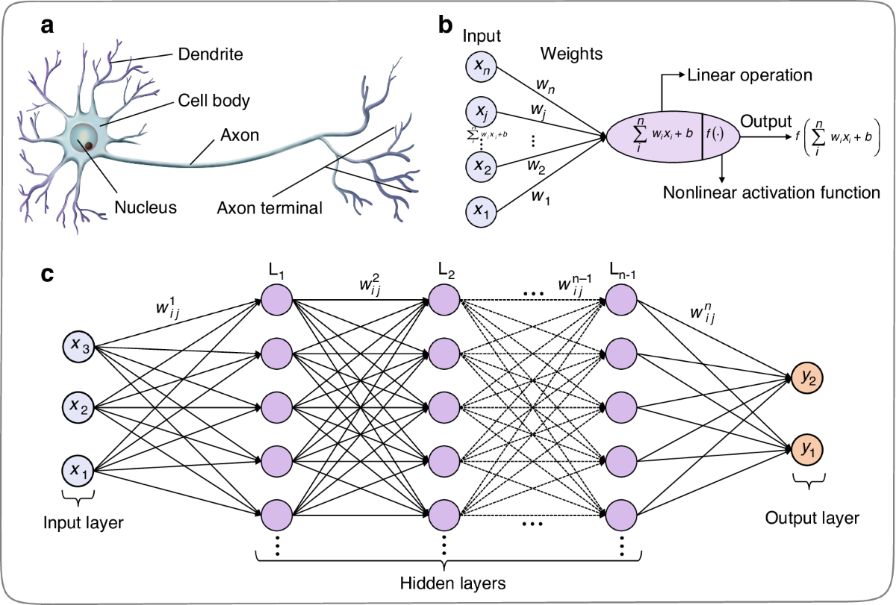
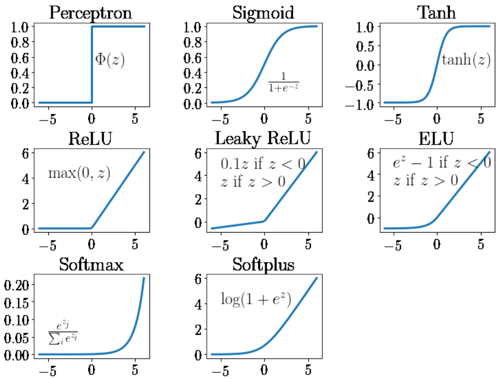
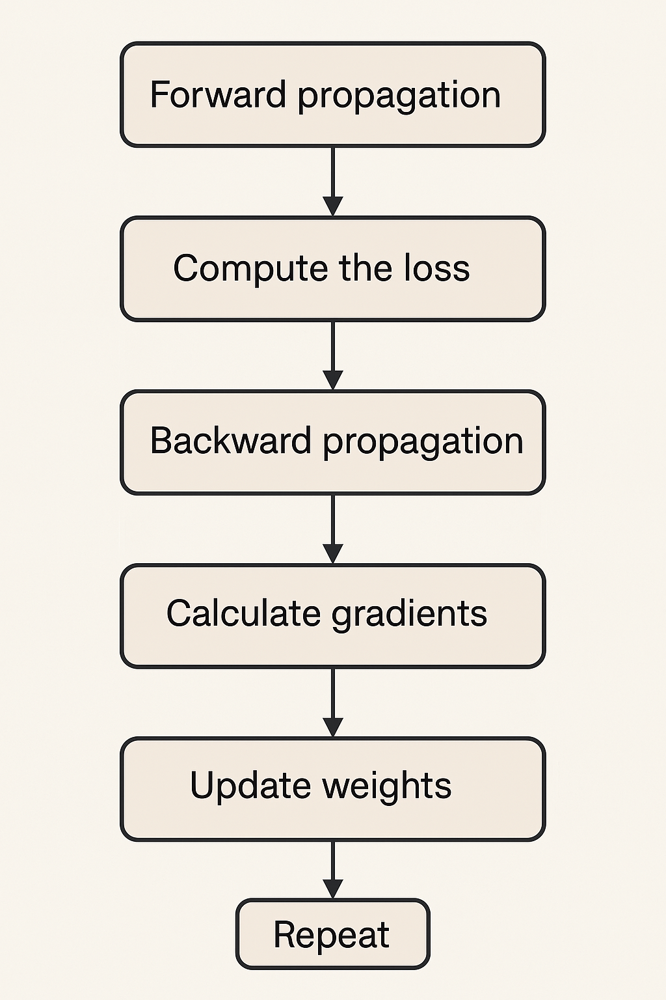

<style>
img[alt~="center"] {
  display: block;
  margin: 0 auto;
}
</style>

### Artificial Neural Network (ANN)/
### Jaringan Syaraf Tiruan (JST)
https://github.com/as-budi/Embedded_AI.git

---

### **Apa itu Jaringan Syaraf Tiruan (JST)?**

- **Jaringan Syaraf Tiruan** adalah **model komputasi** yang terinspirasi dari cara kerja otak manusia.
- Otak manusia terdiri dari miliaran neuron yang saling terhubung.
- JST meniru ini dengan menggunakan **neuron buatan (artificial neurons)** untuk memproses informasi.

---

### **Struktur Dasar JST**
1. **Input Layer (Lapisan Masukan)**  
   - Menerima data mentah.
   - Setiap neuron di lapisan ini mewakili satu fitur dari data.

2. **Hidden Layer(s) (Lapisan Tersembunyi)**  
   - Memproses informasi menggunakan bobot dan fungsi aktivasi.
   - Bisa lebih dari satu (deep learning = banyak hidden layers).

3. **Output Layer (Lapisan Keluaran)**  
   - Menghasilkan prediksi atau klasifikasi akhir.

---



---

### **Cara Kerja JST (Forward Propagation)**

1. Data masuk ke lapisan input.
2. Setiap neuron menghitung:
   $
   z = \sum (w_i \cdot x_i) + b
   $
   Di mana:
   - $x_i$ = input
   - $w_i$ = bobot
   - $b$ = bias
---
3. Hasil $z$ diproses oleh **fungsi aktivasi** seperti:
   - **Sigmoid**: cocok untuk klasifikasi biner.
   - **ReLU**: populer dalam deep learning.
   - **Softmax**: untuk multi-klasifikasi.

---
#### **1. Sigmoid**
- Fungsi sigmoid memetakan input ke rentang $(0, 1)$, cocok untuk **klasifikasi biner**.
   - $\sigma(x) = \frac{1}{1 + e^{-x}}$
- Turunannya:
   - $\sigma'(x) = \sigma(x) \cdot (1 - \sigma(x))$

---

#### **2. Hyperbolic Tangent (tanh)**
- Fungsi tanh memetakan input ke rentang $(-1, 1)$, memiliki output yang lebih "terpusat" di nol daripada sigmoid.
   - $\tanh(x) = \frac{e^x - e^{-x}}{e^x + e^{-x}}$
- Turunannya:
   - $\tanh'(x) = 1 - \tanh^2(x)$

---

#### **3. ReLU (Rectified Linear Unit)**
- Fungsi ReLU adalah yang paling sering digunakan dalam deep learning karena efisiensi komputasinya.
   - $\text{ReLU}(x) = \max(0, x)$
- Turunannya:
   - $\text{ReLU}'(x) = 
\begin{cases}
1 & \text{jika } x > 0 \\
0 & \text{jika } x \leq 0
\end{cases}$

---

#### **4. Leaky ReLU**
- Varian ReLU yang mengatasi masalah **"dying ReLU"** (neuron yang selalu mati saat gradien = 0).
   - $
\text{Leaky ReLU}(x) = 
\begin{cases}
x & \text{jika } x > 0 \\
\alpha x & \text{jika } x \leq 0
\end{cases}
$

   - Biasanya $\alpha = 0.01$

---

### **5. Softmax**
- Digunakan di lapisan output untuk **klasifikasi multi-kelas**. Mengubah output menjadi **probabilitas**.
   - $\text{Softmax}(z_i) = \frac{e^{z_i}}{\sum_{j=1}^{K} e^{z_j}}$
   - Untuk $i = 1, 2, ..., K$ kelas.

---


---
### **Proses Pelatihan (Training)**
- Tujuan pelatihan adalah **menyesuaikan bobot** agar prediksi JST semakin akurat.
   1. **Forward Propagation**: menghitung prediksi.
   2. **Loss Function**: mengukur seberapa jauh hasil prediksi dari nilai sebenarnya (misalnya MSE atau cross-entropy).
   3. **Backward Propagation**: menghitung **gradien kesalahan** dan **memperbarui bobot** dengan **algoritma optimisasi** (misalnya Gradient Descent).
   4. **Iterasi** selama beberapa epoch (pengulangan seluruh data pelatihan).

---



---

### 🧮 **Langkah-Langkah Backpropagation**

#### **1. Forward Propagation (Propagasi Maju)**

Hitung output jaringan dari input sampai ke output:

Untuk setiap neuron:

$
z = \sum (w_i \cdot x_i) + b \quad \text{(kombinasi linier)}
$
$
a = \text{activation}(z) \quad \text{(fungsi aktivasi seperti sigmoid)}
$

---

#### **2. Hitung Error (Loss Function)**

Gunakan fungsi error/loss (misalnya **Mean Squared Error / MSE**):

$
\text{MSE} = \frac{1}{2} (y_{\text{target}} - y_{\text{pred}})^2
$

---

#### **3. Backward Propagation (Hitung Gradien)**

Gunakan **aturan rantai (chain rule)** dari kalkulus untuk menghitung turunan dari loss terhadap bobot.

---

#### 📌 Contoh Rumus pada Output Layer:

Untuk neuron output:

$
\delta^{(output)} = (a^{(output)} - y) \cdot f'(z^{(output)})
$

- $a^{(output)}$: output dari JST
- $y$: target
- $f'(z)$: turunan fungsi aktivasi, contoh untuk sigmoid:
  $
  f'(z) = a \cdot (1 - a)
  $

---

#### 📌 Untuk Hidden Layer:

$
\delta^{(hidden)} = (w^{(output)} \cdot \delta^{(output)}) \cdot f'(z^{(hidden)})
$

- Menyebarkan kesalahan ke lapisan tersembunyi

---

#### **4. Update Bobot (Weight Update Rule)**

$
w = w - \eta \cdot \frac{\partial L}{\partial w}
$

atau:

$
w_{ij}^{(new)} = w_{ij}^{(old)} - \eta \cdot a_j \cdot \delta_i
$

- $w_{ij}$: bobot dari neuron $j$ ke $i$
- $\eta$: **learning rate** (biasanya antara 0.01–0.1)
- $a_j$: output dari neuron sebelumnya
- $\delta_i$: error dari neuron saat ini

---

### **Contoh perhitungan manual JST untuk XOR**
- XOR akan menghasilkan **1 hanya jika satu saja** dari input bernilai 1.
- Jika kedua input **sama** (0-0 atau 1-1), hasilnya adalah 0.
   | Input A | Input B | Output XOR |
   |---------|---------|------------|
   |   0     |    0    |     0      |
   |   0     |    1    |     1      |
   |   1     |    0    |     1      |
   |   1     |    1    |     0      |


---
#### 🧠 **Struktur Jaringan**
- **2 neuron input** (untuk input $x_1, x_2$)
- **2 neuron hidden layer** (aktivasi sigmoid)
- **1 neuron output** (aktivasi sigmoid)
- Learning rate ($\eta$) = 0.5

---

#### 📥 **Input dan Target**
Kita ambil satu kasus XOR:  
$
x_1 = 0,\quad x_2 = 1,\quad y = 1
$

---

#### 🔧 **Bobot Awal dan Bias**
##### Hidden Layer
- $w_{1,1}^{(h)} = 0.1,\quad w_{2,1}^{(h)} = 0.2$ (untuk neuron h1)
- $w_{1,2}^{(h)} = -0.1,\quad w_{2,2}^{(h)} = 0.1$ (untuk neuron h2)
- $b_1 = 0.1,\quad b_2 = 0.1$

##### Output Layer
- $w_{h1}^{(o)} = 0.3,\quad w_{h2}^{(o)} = 0.2$
- $b_o = 0.1$

---

#### 🔹 **Step 1: Forward Propagation**

##### 💡 Hidden Layer Activations:

- **Neuron h1:**
$
z_1 = (0.1 \cdot 0) + (0.2 \cdot 1) + 0.1 = 0.2 + 0.1 = 0.3
$
$
a_1 = \sigma(0.3) = \frac{1}{1 + e^{-0.3}} \approx 0.574
$

- **Neuron h2:**
$
z_2 = (-0.1 \cdot 0) + (0.1 \cdot 1) + 0.1 = 0.1 + 0.1 = 0.2
$
$
a_2 = \sigma(0.2) = \frac{1}{1 + e^{-0.2}} \approx 0.550
$
---
- 🔚 Output Layer:
$
z_o = (0.3 \cdot 0.574) + (0.2 \cdot 0.550) + 0.1 \approx  0.382
$
$
a_o = \sigma(0.382) \approx \frac{1}{1 + e^{-0.382}} \approx 0.5947
$

---

#### 🔹 **Step 2: Hitung Error**

- Gunakan **Mean Squared Error (MSE)**:
$
\text{Error} = \frac{1}{2}(y - a_o)^2 = \frac{1}{2}(1 - 0.5947)^2 \approx 0.0826
$

---

#### 🔹 **Step 3: Backward Propagation**

- ✅ **Error pada output layer**:
$
\delta_o = (a_o - y) \cdot \sigma'(z_o)
$
$
\sigma'(z_o) = a_o(1 - a_o) = 0.5947 \cdot (1 - 0.5947) \approx 0.241
$
$
\delta_o = (0.5947 - 1) \cdot 0.241 \approx -0.4053 \cdot 0.241 \approx -0.0977
$

- ✅ **Update bobot ke output layer**:
Bobot dari $h_1$ ke output:
$
w_{h1}^{new} = w_{h1}^{old} - \eta \cdot \delta_o \cdot a_1 = 0.3 - 0.5 \cdot (-0.0977) \cdot 0.574 \approx 0.328
$
Bobot dari $h_2$ ke output:
$
w_{h2}^{new} = 0.2 - 0.5 \cdot (-0.0977) \cdot 0.550 \approx 0.2 + 0.0268 = 0.2268
$
Bias output:
$
b_o^{new} = b_o - \eta \cdot \delta_o = 0.1 + 0.0489 = 0.1489
$

---

#### ✅ **Error pada hidden layer**

- **Neuron h1:**
$
\delta_1 = \delta_o \cdot w_{h1}^{old} \cdot \sigma'(z_1)
$
$
\sigma'(z_1) = a_1(1 - a_1) = 0.574 \cdot (1 - 0.574) \approx 0.244
$
$
\delta_1 = -0.0977 \cdot 0.3 \cdot 0.244 \approx -0.00715
$

- **Update bobot input ke h1:**
$
w_{1,1}^{new} = w_{1,1} - \eta \cdot \delta_1 \cdot x_1 = 0.1 - 0.5 \cdot (-0.00715) \cdot 0 = 0.1
$
$
w_{2,1}^{new} = 0.2 - 0.5 \cdot (-0.00715) \cdot 1 \approx 0.2 + 0.00357 = 0.2036
$
$
b_1^{new} = 0.1 - 0.5 \cdot (-0.00715) = 0.1036
$
---

- **Neuron h2:**
$
\sigma'(z_2) = a_2(1 - a_2) = 0.550 \cdot (1 - 0.550) \approx 0.247
$
$
\delta_2 = -0.0977 \cdot 0.2 \cdot 0.247 \approx -0.0048
$

- **Update bobot ke h2:**
$
w_{1,2}^{new} = -0.1 - 0.5 \cdot (-0.0048) \cdot 0 = -0.1
$
$
w_{2,2}^{new} = 0.1 - 0.5 \cdot (-0.0048) \cdot 1 \approx 0.1 + 0.0024 = 0.1024
$
$
b_2^{new} = 0.1 - 0.5 \cdot (-0.0048) = 0.1024
$

---

#### **Contoh Implementasi Kode Python untuk kasus XOR**

```python
import numpy as np
import tensorflow as tf
from tensorflow.keras.models import Sequential
from tensorflow.keras.layers import Dense

# 1. Dataset XOR
# Input: kombinasi 2-bit
X = np.array([[0, 0],
              [0, 1],
              [1, 0],
              [1, 1]])

# Output: XOR
y = np.array([[0],
              [1],
              [1],
              [0]])

# 2. Model jaringan syaraf tiruan
model = Sequential([
    Dense(2, input_dim=2, activation='sigmoid'),  # hidden layer
    Dense(1, activation='sigmoid')                # output layer
])

# 3. Kompilasi model
model.compile(optimizer='sgd', loss='mean_squared_error', metrics=['binary_accuracy'])

# 4. Pelatihan model
model.fit(X, y, epochs=5000, verbose=0)

# 5. Evaluasi hasil
predictions = model.predict(X)
print("Prediksi XOR:")
for i in range(len(X)):
    print(f"{X[i]} -> {predictions[i][0]:.4f}")
```

---
#### **Contoh Implementasi Kode Python klasisfikasi IRIS**

```python
import numpy as np
import tensorflow as tf
from sklearn.datasets import load_iris
from sklearn.model_selection import train_test_split
from sklearn.preprocessing import OneHotEncoder, StandardScaler

# 1. Load dataset Iris
iris = load_iris()
X = iris.data                 # fitur: 4 kolom
y = iris.target.reshape(-1, 1)  # label: 0, 1, 2

# 2. One-hot encoding label
encoder = OneHotEncoder(sparse_output=False)
y_encoded = encoder.fit_transform(y)

# 3. Normalisasi fitur
scaler = StandardScaler()
X_scaled = scaler.fit_transform(X)

# 4. Split data latih dan uji
X_train, X_test, y_train, y_test = train_test_split(X_scaled, y_encoded, test_size=0.2, random_state=42)

# 5. Bangun model jaringan syaraf tiruan
model = tf.keras.Sequential([
    tf.keras.layers.Dense(10, input_shape=(4,), activation='relu'),  # hidden layer
    tf.keras.layers.Dense(3, activation='softmax')  # output layer untuk 3 kelas
])

# 6. Kompilasi model
model.compile(optimizer='adam',
              loss='categorical_crossentropy',
              metrics=['accuracy'])

# 7. Latih model
model.fit(X_train, y_train, epochs=100, batch_size=5, verbose=1)

# 8. Evaluasi model
loss, accuracy = model.evaluate(X_test, y_test)
print(f"\nAkurasi pada data uji: {accuracy:.4f}")

# 9. Contoh prediksi
predictions = model.predict(X_test)
predicted_classes = np.argmax(predictions, axis=1)
true_classes = np.argmax(y_test, axis=1)

# Tampilkan beberapa hasil prediksi
for i in range(5):
    print(f"Data: {X_test[i]}, Prediksi: {predicted_classes[i]}, Label Sebenarnya: {true_classes[i]}")
```