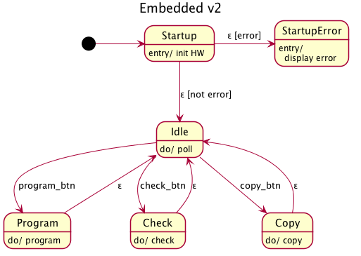
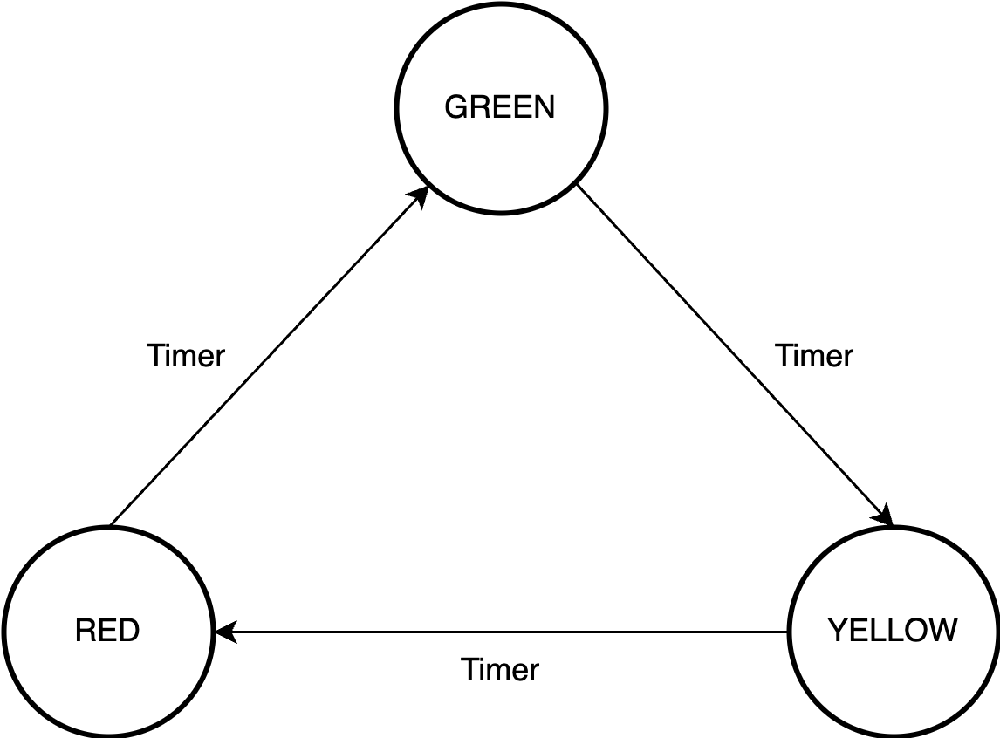

<style>
img[alt~="center"] {
  display: block;
  margin: 0 auto;
}
</style>

### Finite State Machine (FSM) and 
### Real Time Operating System RTOS
https://github.com/as-budi/Embedded_AI.git

---

### **Finite State Machine (FSM)**
- Dalam sistem tertanam (embedded system), **state machine** atau **finite state machine (FSM)** adalah pola pemrograman penting untuk mengelola *control flow* berdasarkan *keadaan (state)* dan *transisi antar state*. 
- FSM sangat berguna untuk mengatur logika kompleks yang bersifat deterministik dan dapat diprediksi, seperti dalam pengontrol perangkat keras, sistem UI, atau robotik.

---

#### 📘 1. **Apa Itu State Machine?**

State Machine adalah model komputasi yang terdiri dari:

* **State (Keadaan):** Kondisi sistem saat ini.
* **Transition (Transisi):** Perubahan dari satu state ke state lain berdasarkan input/event.
* **Event/Input:** Pemicu transisi state.
* **Action:** Proses atau output yang dilakukan saat masuk atau keluar dari state atau saat transisi terjadi.

---

#### ⚙️ 2. **Kapan Digunakan di Embedded System?**

Beberapa contoh penggunaannya:

* Sistem menu UI pada alat ukur digital.
* Pengendali robot berdasarkan sensor.
* Protokol komunikasi (misalnya: UART, SPI, Bluetooth).
* **Mode operasi perangkat:** akuisisi data, inferensi, sleep, idle, active, error, dll.

---


---

#### 🧩 3. **Pola Pemrograman State Machine (Programming Pattern)**

- **State Table Driven FSM:** Menggunakan tabel (array atau struct) untuk mendefinisikan transisi.

- **Switch-Case FSM (paling umum):** Menggunakan pernyataan `switch` untuk menangani setiap state.

- **State Pattern (Object-Oriented FSM):** Setiap state direpresentasikan sebagai objek dengan metode `on_enter`, `on_event`, `on_exit`.

---

#### 💡 4. **Contoh: FSM untuk Lampu Lalu Lintas Sederhana**

* **State:** RED, GREEN, YELLOW
* **Input:** timer
* **Output:** lampu ON/OFF

---


---
#### 🔧 Implementasi dalam C (Switch-case FSM)

```c
typedef enum {RED, GREEN, YELLOW} TrafficState;

TrafficState currentState = RED;
unsigned long timer = 0;

void updateStateMachine() {
    switch(currentState) {
        case RED:
            turnOnRedLight();
            if (millis() - timer > 5000) {
                timer = millis();
                currentState = GREEN;
            }
            break;

        case GREEN:
            turnOnGreenLight();
            if (millis() - timer > 4000) {
                timer = millis();
                currentState = YELLOW;
            }
            break;

        case YELLOW:
            turnOnYellowLight();
            if (millis() - timer > 2000) {
                timer = millis();
                currentState = RED;
            }
            break;
    }
}
```

Fungsi `updateStateMachine()` dipanggil terus-menerus dari `loop()` pada platform seperti Arduino.

---

#### 🧠 Catatan Desain:

* **Non-blocking:** Gunakan `millis()` atau timer, bukan `delay()`, agar sistem tetap responsif.
* **Deklaratif:** Gunakan enum atau struct agar logika FSM dapat dibaca dan diubah dengan mudah.
* **Testable:** Dengan memisahkan logic FSM dari I/O, pengujian bisa dilakukan tanpa perangkat keras.

---

#### 🧪 5. **Alternatif Pendekatan: FSM Pattern dalam C++ (OOP)**

```cpp
class TrafficLightState {
public:
    virtual void enter() = 0;
    virtual TrafficLightState* next() = 0;
};

class Red : public TrafficLightState {
public:
    void enter() { turnOnRedLight(); delay(5000); }
    TrafficLightState* next() { return new Green(); }
};

class Green : public TrafficLightState {
public:
    void enter() { turnOnGreenLight(); delay(4000); }
    TrafficLightState* next() { return new Yellow(); }
};

// dan seterusnya...
```
---
- Pendekatan ini lebih modular, cocok untuk proyek embedded system berbasis RTOS atau sistem kompleks seperti UI/UX pada touchscreen.

---

#### ✅ 6. **Best Practice FSM di Embedded System**

| Aspek               | Rekomendasi                                                                |
| ------------------- | -------------------------------------------------------------------------- |
| Struktur kode       | Gunakan `enum`, `switch-case`, atau object pattern                         |
| Efisiensi           | Hindari blocking function (`delay`)                                        |
| Skalabilitas        | Pisahkan FSM dan I/O (Hardware Abstraction Layer)                          |
| Debugging           | Tambahkan state logging saat transisi                                      |
| Kompleksitas tinggi | Pertimbangkan penggunaan FSM framework (misal: QP-nano dari Quantum Leaps) |

---
#### FSM Template

```cpp
// ================== ENUM STATE ==================
enum State {
  STATE_INIT,
  STATE_IDLE,
  STATE_ACQUIRE,
  STATE_PROCESS,
  STATE_COMMUNICATE,
  STATE_ERROR
};

State currentState = STATE_INIT;

// ================== TIMER UTILITY ==================
unsigned long stateTimer = 0;
unsigned long interval = 1000;

// ================== SETUP ==================
void setup() {
  Serial.begin(115200);
  delay(1000); // Waktu boot

  // Inisialisasi awal sistem
  initHardware();
  currentState = STATE_IDLE;
}
```
---
```cpp
// ================== LOOP ==================
void loop() {
  switch (currentState) {
    case STATE_IDLE:
      if (millis() - stateTimer > interval) {
        currentState = STATE_ACQUIRE;
        stateTimer = millis();
      }
      break;

    case STATE_ACQUIRE:
      if (acquireSensorData()) {
        currentState = STATE_PROCESS;
      } else {
        currentState = STATE_ERROR;
      }
      break;

    case STATE_PROCESS:
      processData();
      currentState = STATE_COMMUNICATE;
      break;

    case STATE_COMMUNICATE:
      communicateData();
      currentState = STATE_IDLE;
      stateTimer = millis();
      break;

    case STATE_ERROR:
      handleError();
      currentState = STATE_IDLE;
      break;

    default:
      currentState = STATE_ERROR;
      break;
  }
}
```
---
```cpp
// ================== FUNGSI STATE ==================

void initHardware() {
  // Inisialisasi sensor, WiFi, atau lainnya
  Serial.println("Inisialisasi selesai");
}

bool acquireSensorData() {
  // Baca sensor
  Serial.println("Membaca data sensor...");
  // Return true jika berhasil
  return true;
}

void processData() {
  // Pemrosesan data, filtering, atau inferensi
  Serial.println("Memproses data...");
}

void communicateData() {
  // Kirim data via Serial, WiFi, MQTT, dsb.
  Serial.println("Mengirim data...");
}

void handleError() {
  Serial.println("Terjadi kesalahan!");
  // Reset atau recovery
}
```
---

### **Real Time Operating System (RTOS)**
- **RTOS (Real-Time Operating System)** adalah sistem operasi ringan yang dirancang untuk menjalankan *task* secara deterministik dalam sistem tertanam (embedded system).
- Berbeda dengan general-purpose OS (seperti Linux), RTOS menjamin bahwa proses tertentu selesai dalam *bounded time* atau waktu yang telah ditentukan—itulah mengapa disebut “real-time.”

---

#### 🧠 1. **Konsep Dasar RTOS**

RTOS mengatur eksekusi berbagai task dengan fitur utama:

* **Task/Thread Scheduling**
* **Multitasking (Preemptive atau Cooperative)**
* **Inter-task Communication (Queue, Semaphore, Mutex)**
* **Time Management (Timers, Delay)**
* **Interrupt Handling**
---
Contoh RTOS populer:

* **FreeRTOS** (paling banyak digunakan dalam ESP32)
* Zephyr RTOS
* RT-Thread
* CMSIS-RTOS (untuk ARM Cortex-M)

---

#### 🤖 2. **Penggunaan RTOS dalam Embedded AI**

Dalam konteks **Embedded AI**, RTOS memainkan peran penting dalam menjalankan berbagai tugas secara efisien, seperti:

##### ✅ **A. Inferensi AI + Sensor + Komunikasi**

Bayangkan ESP32 menjalankan model AI (TFLite Micro), sambil:

* Mengambil data dari sensor
* Menjalankan pre-processing
* Melakukan inferensi AI
* Mengirim hasilnya via Wi-Fi/MQTT
---
RTOS memungkinkan semua ini berjalan sebagai task yang terpisah, **tanpa blocking** satu sama lain.

| Komponen        | Task di RTOS        |
| --------------- | ------------------- |
| Sensor          | `TaskSensorRead()`  |
| Preprocessing   | `TaskPreprocess()`  |
| AI Inference    | `TaskAIInference()` |
| Komunikasi MQTT | `TaskPublishMQTT()` |

---

##### ✅ **B. Manajemen Memori dan Waktu**

AI model inference butuh buffer input/output besar. RTOS:

* Menyediakan alokasi memori statis (heap/task-local)
* Menjamin inferensi tidak terganggu oleh komunikasi atau input
* Mengatur waktu inferensi agar tidak melampaui *deadline*

---

##### ✅ **C. Low Power + Wake on Event**

RTOS dapat mengatur sistem ke *sleep mode*, lalu bangun hanya saat:

* Interrupt sensor aktif (motion, suara, dll)
* Input data tersedia
* Inferensi perlu dijalankan

Contoh: Kamera dengan ESP32-CAM + AI hanya aktif saat gerakan terdeteksi.

---

#### 🧪 3. **Contoh FreeRTOS pada ESP32 + AI**

```cpp
void TaskSensorRead(void *pvParameters) {
  for (;;) {
    readSensor();
    vTaskDelay(100 / portTICK_PERIOD_MS);
  }
}

void TaskAIInference(void *pvParameters) {
  for (;;) {
    if (dataAvailable) {
      runInference();
    }
    vTaskDelay(200 / portTICK_PERIOD_MS);
  }
}

void setup() {
  xTaskCreatePinnedToCore(TaskSensorRead, "Sensor", 2048, NULL, 1, NULL, 1);
  xTaskCreatePinnedToCore(TaskAIInference, "Inference", 4096, NULL, 2, NULL, 1);
}
```
---
#### **Fungsi `xTaskCreatePinnedToCore()`** 
- Fungsi ini adalah bagian dari **FreeRTOS** pada ESP32 yang digunakan untuk membuat dan menjalankan **task (thread)**, serta menetapkan task tersebut berjalan di core yang mana (ESP32 memiliki 2 core: core 0 dan core 1).

---

#### 🧩 Sintaks Umum

```cpp
BaseType_t xTaskCreatePinnedToCore(
    TaskFunction_t pvTaskCode,
    const char * const pcName,
    const uint32_t usStackDepth,
    void *pvParameters,
    UBaseType_t uxPriority,
    TaskHandle_t *pvCreatedTask,
    const BaseType_t xCoreID
);
```

---

#### 🧠 Penjelasan Argumen
```
xTaskCreatePinnedToCore(TaskSensorFSM, "SensorTask", 2048, NULL, 1, NULL, 1);`
```
| No | Argumen         | Nilai           | Fungsi                                                                                                                                                          |
| -- | --------------- | --------------- | --------------------------------------------------------------------------------------------------------------------------------------------------------------- |
| 1  | `pvTaskCode`    | `TaskSensorFSM` | Fungsi yang akan dijalankan sebagai task (harus `void function(void* param)` dan infinite loop `while(1)`)                                                      |
| 2  | `pcName`        | `"SensorTask"`  | Nama task untuk debugging/logging                                                                                                                               |
---
| No | Argumen         | Nilai           | Fungsi                                                                                                                                                          |
| -- | --------------- | --------------- | --------------------------------------------------------------------------------------------------------------------------------------------------------------- |
| 3  | `usStackDepth`  | `2048`          | Ukuran stack task dalam *word* (1 word = 4 byte pada ESP32), berarti 2048 × 4 = **8192 byte stack memory**                                                      |
| 4  | `pvParameters`  | `NULL`          | Parameter yang akan dikirim ke fungsi task. Bisa `NULL` jika tidak digunakan                                                                                    |
| 5  | `uxPriority`    | `1`             | Prioritas task (lebih besar = lebih prioritas)                                                                                                                  |
---
| No | Argumen         | Nilai           | Fungsi                                                                                                                                                          |
| -- | --------------- | --------------- | --------------------------------------------------------------------------------------------------------------------------------------------------------------- |
| 6  | `pvCreatedTask` | `NULL`          | Alamat variabel untuk menyimpan handle task jika ingin mengontrol (suspend/resume/delete). Jika tidak perlu, isi `NULL`                                         |
| 7  | `xCoreID`       | `1`             | Nomor core tempat task ini dijalankan:<br> `0` = core 0 (proses utama)<br> `1` = core 1 (biasanya untuk komunikasi/AI)<br> `tskNO_AFFINITY` = bisa di mana saja |

---

#### ⚠️ Catatan Tambahan

* **ESP32 memiliki dua core:**

  * **Core 0**: untuk tugas utama dan Wi-Fi
  * **Core 1**: untuk tugas tambahan (rekomendasi untuk sensor, AI, dsb.)
* **Ukuran stack (`2048`)** harus cukup besar terutama untuk tugas berat seperti AI.
* **Prioritas (`1`)** lebih tinggi akan mendahului task lain dengan prioritas lebih rendah.

---

#### 🧪 Contoh Kasus

Jika Anda ingin:

* `TaskSensorFSM`: berjalan di core 1 untuk membaca sensor secara berkala
* `TaskInferenceFSM`: inferensi AI, diletakkan di core 0

Maka:

```cpp
xTaskCreatePinnedToCore(TaskSensorFSM, "Sensor", 2048, NULL, 1, NULL, 1);  // Core 1
xTaskCreatePinnedToCore(TaskInferenceFSM, "AI", 4096, NULL, 2, NULL, 0);   // Core 0
```

---

#### 🧱 `vTaskDelay(tickDelay)`

- Fungsi ini **menunda eksekusi task saat ini**, dan membiarkan FreeRTOS menjalankan task lain. Task akan “tidur” selama jumlah **tick** tertentu, lalu aktif kembali.

#### 🧮 `100 / portTICK_PERIOD_MS`

- FreeRTOS menghitung waktu dalam satuan **tick**, bukan milidetik. Maka dari itu, `portTICK_PERIOD_MS` digunakan untuk mengonversi **milidetik → tick**.
---
| Komponen                  | Fungsi                                                                                                                            |
| ------------------------- | --------------------------------------------------------------------------------------------------------------------------------- |
| `100`                      | Waktu delay dalam **milidetik**                                                                                                   |
| `portTICK_PERIOD_MS`      | Konstanta yang menyatakan **berapa milidetik dalam satu tick**<br>Default-nya adalah `1 ms/tick` jika `configTICK_RATE_HZ = 1000` |
| `100 / portTICK_PERIOD_MS` | Jumlah tick untuk delay 100 ms                                                                                                     |

---

#### 🧠 Contoh Perhitungan

- `configTICK_RATE_HZ = 1000` (default untuk ESP32)
- Maka `portTICK_PERIOD_MS = 1`

```cpp
vTaskDelay(100 / 1);  // Delay 100 tick = 100 ms
```

- Jika kita ubah `configTICK_RATE_HZ = 100`, maka `portTICK_PERIOD_MS = 10`, dan:

```cpp
vTaskDelay(100 / 10);  // Delay 10 tick = 100 ms
```

---

#### ⚙️ Karakteristik `vTaskDelay()`

| Sifat                                   | Penjelasan                                                 |
| --------------------------------------- | ---------------------------------------------------------- |
| Non-blocking                            | Task lain masih bisa jalan selama delay                    |
| Relative delay                          | Delay dihitung sejak fungsi dipanggil                      |
| Aman digunakan                          | Cocok untuk loop di dalam task                             |
| Tidak cocok untuk timing presisi tinggi | Gunakan timer/interrupt untuk kebutuhan presisi mikrodetik |

---

Jika Anda ingin kontrol waktu delay lebih tepat (misal: delay absolut atau periodik), kita bisa gunakan `vTaskDelayUntil()`. Mau saya jelaskan juga perbedaannya?

---

#### 📦 4. **Manfaat RTOS untuk Embedded AI**

| Manfaat               | Penjelasan                                                                                      |
| --------------------- | ----------------------------------------------------------------------------------------------- |
| **Responsiveness**    | Task inferensi AI tidak mengganggu task I/O                                                     |
| **Determinism**       | Setiap task berjalan sesuai prioritas                                                           |
| **Resource Sharing**  | RTOS membantu sinkronisasi antar task via queue/semaphore                                       |
| **Multicore Support** | ESP32 + FreeRTOS: bisa assign task ke core tertentu                                             |
| **Scalability**       | Menambahkan lebih fitur tanpa membuat sistem menjadi blocking |

---

#### 🚧 5. **Tantangan**

* **Manajemen Memori** (AI + RTOS membutuhkan stack besar)
* **Prioritas Task yang salah** bisa menyebabkan jitter
* **Debugging multithreaded** lebih kompleks daripada single loop
* **Real-time guarantees** sulit dicapai dengan AI model yang besar

---

#### 🔧 **Penggabungan FSM dan RTOS**

| RTOS                               | FSM                                         |
| ---------------------------------- | ------------------------------------------- |
| Menangani *task-level concurrency* | Menangani *internal logic per task*         |
| Efisien untuk multitasking         | Efisien untuk mengontrol alur status        |
| Cocok untuk komunikasi antar modul | Cocok untuk manajemen alur di dalam 1 modul |

➡️ **Gabungan RTOS + FSM = multitasking sistem cerdas dengan kendali status yang rapi**

---

#### 💡 **Struktur Desain: FSM di dalam Task RTOS**

```text
TaskSensor()       → FSM: {INIT → ACQUIRE → IDLE}
TaskInference()    → FSM: {WAIT_DATA → RUN_AI → REPORT}
TaskCommunication()-> FSM: {CONNECT → PUBLISH → WAIT_ACK}
```

Setiap task FreeRTOS dapat memiliki FSM-nya sendiri, menggunakan `enum` dan `switch-case`.

---

#### 🧩 **Contoh Implementasi FSM + RTOS pada ESP32**

```cpp
enum SensorState { SENSOR_INIT, SENSOR_READ, SENSOR_IDLE };
enum InferenceState { INFER_WAIT, INFER_RUN };

SensorState sensorState = SENSOR_INIT;
InferenceState inferenceState = INFER_WAIT;

void setup() {
  xTaskCreatePinnedToCore(TaskSensorFSM, "SensorTask", 2048, NULL, 1, NULL, 1);
  xTaskCreatePinnedToCore(TaskInferenceFSM, "InferenceTask", 4096, NULL, 2, NULL, 1);
}

void loop() {}

void TaskSensorFSM(void* pvParameters) {
  while (1) {
    switch (sensorState) {
      case SENSOR_INIT:
        Serial.println("Init sensor");
        sensorState = SENSOR_READ;
        break;

      case SENSOR_READ:
        temperature = dht.readTemperature();
        if (!isnan(temperature)) {
          dataReady = true;
          sensorState = SENSOR_IDLE;
        } else {
          Serial.println("Read error");
        }
        break;

      case SENSOR_IDLE:
        vTaskDelay(5000 / portTICK_PERIOD_MS);
        sensorState = SENSOR_READ;
        break;
    }
    vTaskDelay(50 / portTICK_PERIOD_MS);
  }
}

void TaskInferenceFSM(void* pvParameters) {
  while (1) {
    switch (inferenceState) {
      case INFER_WAIT:
        if (dataReady) {
          inferenceState = INFER_RUN;
        }
        break;

      case INFER_RUN:
        input->data.f[0] = temperature / 45.0;
        if (interpreter->Invoke() == kTfLiteOk) {
          float result = output->data.f[0];
          if (result < 0.3) Serial.println("NORMAL");
          else if (result < 0.7) Serial.println("DEMAM RINGAN");
          else Serial.println("DEMAM BERAT");
        }
        dataReady = false;
        inferenceState = INFER_WAIT;
        break;
    }
    vTaskDelay(100 / portTICK_PERIOD_MS);
  }
}
```

